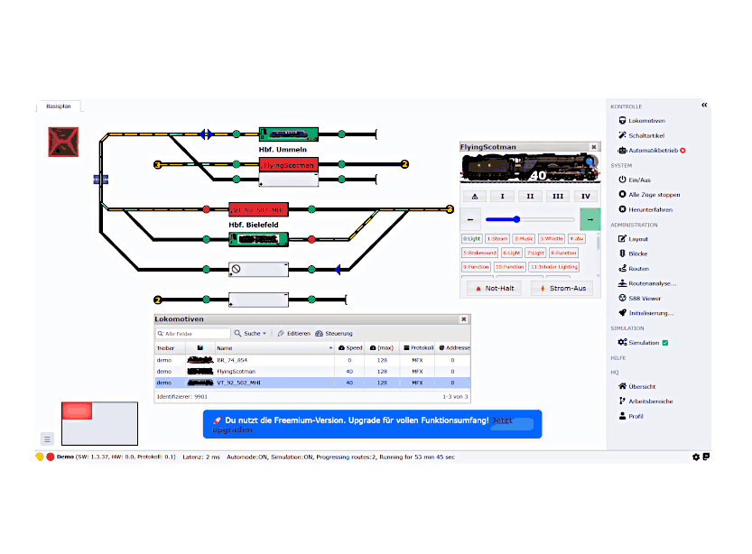

# 🚂 railhq.io - Model Railway Headquarters

[](https://dotnet.microsoft.com/)
[](https://www.docker.com/)
[](LICENSE)
[](https://railhq.io/docs)
[](SECURITY.md)

**railhq.io** is a web-based control center for model railways. It provides a modern, browser-based interface to control locomotives, switches, signals, and more - all from any device on your network.



## ⚠️ Important Security Notice

**Default credentials are set for quick start!**
```
Username: free@railhq.io
Password: railhq.io
```

🔒 **Please change these immediately after first login!** See [SECURITY.md](SECURITY.md) for details.

## ✨ Features

- 🎮 **Web-based Control** - Control your model railway from any browser
- 🚂 **Multi-Protocol Support** - Works with ESU ECoS, Roco/Fleischmann z21, and HSI-88-USB
- 📱 **Responsive Design** - Works on desktop, tablet, and mobile devices
- 🔌 **Local Gateway** - Connect your command stations via the railhq Gateway
- 🎨 **Visual Track Plan** - Create and edit your track layout visually
- 🤖 **Automation** - Script-based automation for routes and sequences
- 👥 **Multi-User** - Multiple users can control the layout simultaneously

## 🏗️ Architecture

The system consists of three main components:

```
┌─────────────────┐     ┌─────────────────┐     ┌─────────────────┐
│   Web Browser   │───▶│   railhq.io     │───▶│    Gateway      │
│   (Any Device)  │◀───│   (Server)      │◀───│   (Local PC)    │
└─────────────────┘     └─────────────────┘     └─────────────────┘
                                                        │
                                                        ▼
                                                ┌───────────────┐
                                                │ Command       │
                                                │ Station       │
                                                │ (ECoS/z21)    │
                                                └───────────────┘
```

### Components

| Component | Description | Port |
|-----------|-------------|------|
| **railyWebIndex** | User management, login, workspace selection | 80/443 (via nginx) |
| **railyWebApp** | Main application, track plan editor, control | 5001 |
| **railyGateway** | Local gateway connecting to command stations | 8090 |
| **Redis** | Session and cache storage | 6379 |
| **nginx** | Reverse proxy | 80, 443 |

## 🚀 Quick Start

### Prerequisites

- [Docker](https://docs.docker.com/get-docker/) and [Docker Compose](https://docs.docker.com/compose/install/)
- Git

### Installation

```bash
# 1. Clone the repository
git clone https://github.com/cbries/railhq.io.git
cd railhq.io

# 2. Copy the example environment file
cp .env.example .env

# 3. Create data directories
mkdir -p ~/railhq.io/{resources,resourcesSetups,resourcesRedis,resourcesRuntime/nginx,resourcesRuntime/certificates,deployment}

# 4. Copy nginx configuration
cp resourcesRuntime/nginx/*.conf ~/railhq.io/resourcesRuntime/nginx/

# 5. Build and start
docker compose build railhq
docker compose up -d
```

### Access

Open your browser and navigate to:
- **http://localhost** - Main application

**Default credentials:**
```
Username: free@railhq.io
Password: railhq.io
```

> ⚠️ **CRITICAL SECURITY NOTICE:** Change the default password immediately after first login!
> See [SECURITY.md](SECURITY.md) for important security information.

## 📖 Documentation

- [INSTALL.md](INSTALL.md) - Detailed installation guide
- [CONTRIBUTING.md](CONTRIBUTING.md) - How to contribute
- [Gateway/railyHsi88Usb/README.md](Gateway/railyHsi88Usb/README.md) - HSI-88-USB documentation

## 🔧 Configuration

### Environment Variables

| Variable | Description | Default |
|----------|-------------|---------|
| `RAILHQ_DATA_DIR` | Base path for all data | `~/railhq.io` |
| `RAILHQ_LOCAL_MODE` | Enable local/LAN mode | `true` |
| `RAILHQ_USE_TLS` | Enable HTTPS | `false` |
| `NGINX_CONF` | nginx config file | `nginx-http.conf` |

See [.env.example](.env.example) for all available options.

### Supported Command Stations

| Manufacturer | Model | Status |
|--------------|-------|--------|
| ESU | ECoS | ✅ Full support |
| Roco/Fleischmann | z21 | ✅ Full support |
| LDT | HSI-88-USB | ✅ Feedback only |

## 🛠️ Development

### Local Development Setup

```bash
# Prerequisites
# - .NET 8.0 SDK
# - Node.js (for documentation)
# - Redis (local or Docker)

# Start Redis for development
docker compose -f docker-compose-redis.yml up -d

# Build and run (from VS Code or terminal)
dotnet build
dotnet run --project WebApp/railyWebIndex
dotnet run --project WebApp/railyWebApp
```

### Project Structure

```
railhq.io/
├── Gateway/                 # Gateway application
│   ├── railyGateway/       # Main gateway
│   ├── railyEsuEcos/       # ESU ECoS driver
│   ├── railhqZ21/          # z21 driver
│   └── railyHsi88Usb/      # HSI-88-USB driver
├── WebApp/
│   ├── railyWebIndex/      # Login & user management
│   └── railyWebApp/        # Main web application
├── Libraries/              # Shared libraries
├── resources/              # Themes, demo data
└── docker-compose.yml      # Docker configuration
```

## 🐳 Docker

### Build Image

```bash
docker compose build railhq
```

### Run Services

```bash
# Start all services
docker compose up -d

# View logs
docker compose logs -f

# Stop services
docker compose down
```

### Backup & Restore

```bash
# Create backup
docker compose run --rm backup

# Restore resources
docker compose run --rm restoreResources
```

## 🤝 Contributing

We welcome contributions! Please see [CONTRIBUTING.md](CONTRIBUTING.md) for guidelines.

1. Fork the repository
2. Create a feature branch (`git checkout -b feature/amazing-feature`)
3. Commit your changes (`git commit -m 'Add amazing feature'`)
4. Push to the branch (`git push origin feature/amazing-feature`)
5. Open a Pull Request

## 📄 License

This project is licensed under the MIT License - see the [LICENSE](LICENSE) file for details.

**Copyright (c) 2025 Dr. Christian Benjamin Ries**
- Email: mail@cbries.de
- Website: www.riesolution.de
- Location: Bielefeld, Germany

## 🔒 Security

For security concerns, please review our [Security Policy](SECURITY.md).

To report vulnerabilities, contact: mail@cbries.de

## 🙏 Acknowledgments

- ESU for the ECoS command station
- Roco/Fleischmann for the z21 command station
- LDT for the HSI-88-USB interface
- The model railway community

---

Made with ❤️ for the model railway community
