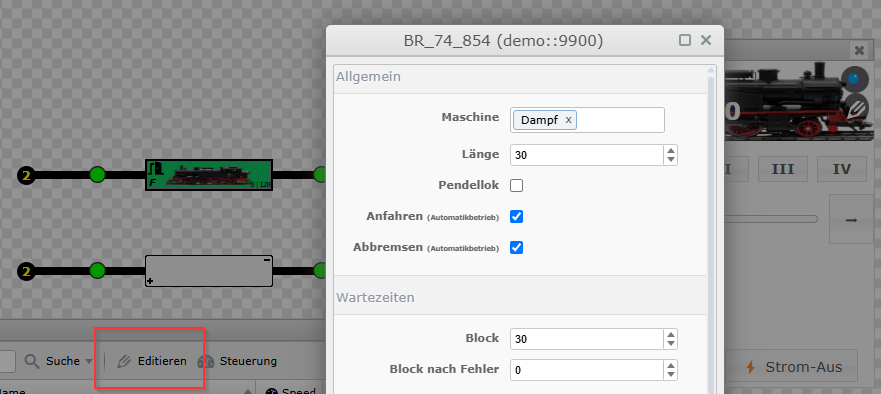

# Anfahr- und Bremsverhalten

`railhq.io` regelt standardmässig das Anfahr- und Bremsverhalten jeder Lokomotive, sobald der Automatikbetrieb aktiviert ist. 
Hierbei wird entsprechend der Geschwindigkeitseinstellungen bis zur Reisegeschwindigkeit, in einer bestimmten Anzahl an Schritten und in einem bestimmten Zeitfenster, kontinuierlich erhöht - so ergibt sich ein langsames Anfahren der entsprechenden Lokomotive. Gleiches gilt für das Abbremsen innerhalb eines Blocks zwischen dem **Enter**-Event und **In**-Event.

Die Einstellung kann für jede Lokomotive einzeln vorgenommen werden.
Den Einstellungsbereich findet ihr über den Lokomotiven-Dialog.
Im nachfolgenden Screenshot sind die entsprechenden Einstellungen über die zwei Optionen **Anfahren** und **Abbremsen** zu tätigen. Standardmässig ist die Automatik von `railhq.io` aktiviert.

