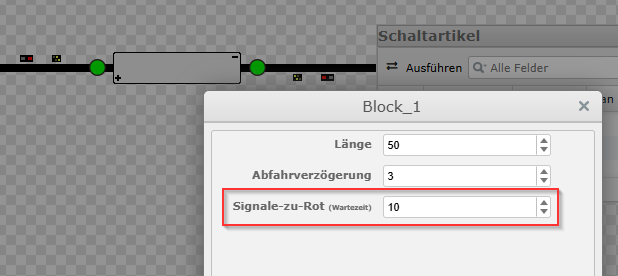
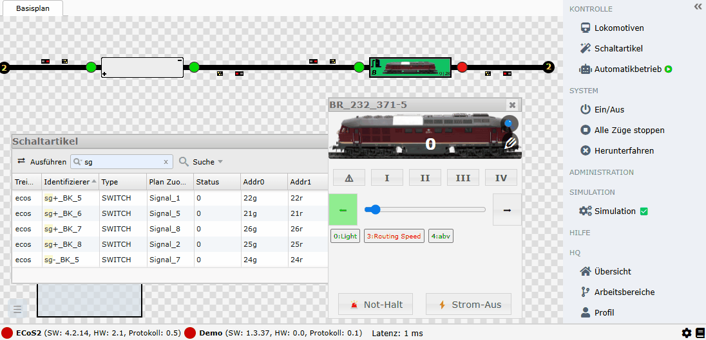

# Blöcke + Signale bei Automatikbetrieb mit Routen

`railhq.io` schaltet für dich automatisch die eingestellten Signale, so dass diese beim geplanten Losfahren einer Lokomotive entsprechend `grün` anzeigen. Die Signale werden automatisch spätestens nach `15 Sekunden` (Default!) wieder zurück auf `rot` geschaltet.

Die Wartezeit bis die Signale von den jeweiligen Blöcken zurück auf `rot` gestellt werden, kann im **Einstellungs-Dialog** der jeweiligen Blöcke eingestellt werden.

Eingestellt werden die Signale wie auch die Sensoren im **Blöcke-Dialog**. Wählt einfach die passenden Signale aus. Die Zuordnung der Signale zu den realen Hardwaresignalen erfolgt über den **Schaltartikel-Dialog**.

