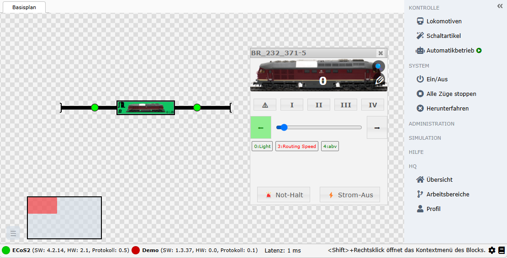
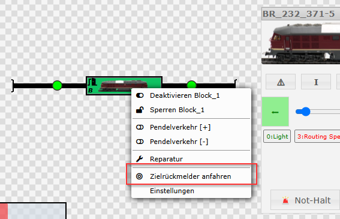
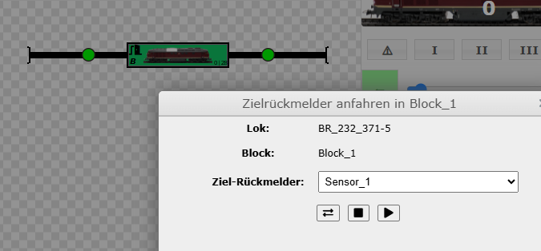
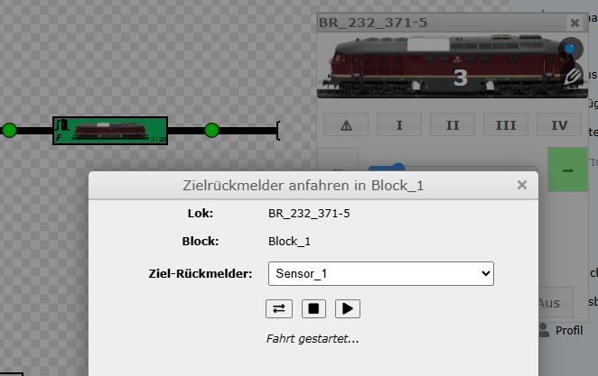
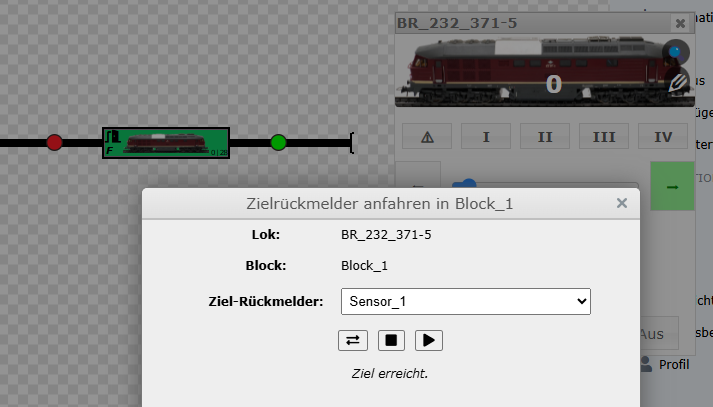

# Automatische Lokpositionierung zum Zielrückmelder 🚂

## Beschreibung

Mit der Funktion **„Zielrückmelder anfahren“** lässt sich eine Lokomotive innerhalb eines Blocks automatisch korrekt positionieren – etwa nach dem Aufgleisen oder nach manuellem Eingriff. Die Lok fährt dazu kontrolliert vorwärts oder rückwärts, bis ein definierter Rückmelder ausgelöst wird.

Die Steuerung erfolgt bequem über das Kontextmenü eines Blocks.

---

## Funktionsweise

1. Mit gedrückter *&lt;Shift&gt;*-Taste + Rechtsklick auf einen Block, in dem sich die Lok befindet.
2. Wähle im Menü **„Zielrückmelder anfahren“**.
3. Im Dialog:
   - wird Lok und Block angezeigt,
   - ein Zielrückmelder kann ausgewählt werden,
   - es wird automatisch die an der Lokomotive eingestellte, minimale Geschindigkeit der gewählt.
4. Mit **„Start“** beginnt die Lokomotive zu fahren.
5. Sobald der Ziel-Rückmelder meldet, **stoppt die Lok automatisch**.
6. Optional:
   - Mit **„Abbrechen“** kann der Vorgang jederzeit gestoppt werden.
   - Falls die Lok bei **„Start“** beginnt in die falsche Richtung zu fahen, kann mit **Fahrtrichtung wechseln** entsprechend die Fahrtrichtung angepasst werden.

### Ausgangssituation nach dem Aufsetzen einer Lokomotive

Die Lokomotive `BR_232_371-5` wurde soeben frisch aufgesetzt und befindet sich innerhalb des Blocks an einer unbestimmten Stelle, entsprechend ist keiner der beiden Sensoren aktiv.

### Funktion auswählen

Wähle mit *&lt;Shift&gt;*-Taste + Rechtsklick die Funktion aus.

### Funktion einstellen

Wähle den Zielsensor aus, es werden nur die Sensor aufgeführt, welche man im Vorfeld für einen Block eingestellt hat. Siehe auch [Blockeinstellungen](../tutorial-erster-gleisplan/gleisplan-start.md#blöcke).

### Start

Wähle **Start** und die Lokomotive sollte sich in Richtung des ausgewählten Sensors bewegen, falls nicht, so kann die Fahrtrichtung entsprechend angepasst werden. Nach Erreichen des gewählten Zielsensors stoppt die Lokomotive und es wird eine passende Meldung ausgegeben.

---

## Vorteile

- ⏱ **Zeitersparnis**  
  Kein manuelles Herantasten mehr – die Lok fährt automatisch an die korrekte Stelle.

- 🎯 **Genauigkeit**  
  Die Lok wird zuverlässig bis zum gewünschten Rückmelder geführt – reproduzierbar und millimetergenau.

- 🧠 **Komfort und Einfachheit**  
  Die Bedienung ist intuitiv und im Webfrontend vollständig integriert.

- 🔁 **Fehlerkorrektur**  
  Falsche Richtung? Kein Problem – die Fahrtrichtung der Lok kann direkt umgestellt werden.

- 🧼 **Bessere Betriebsbereitschaft**  
  Besonders hilfreich nach Störungen oder Wartungsarbeiten – die Lok ist danach wieder korrekt eingeordnet.

---

## Typische Anwendungsfälle

- Nach dem Aufgleisen einer Lokomotive ohne definierte Startposition.
- Nach einem unerwarteten Halt oder Stromausfall.
- Bei Wartungsarbeiten oder Änderungen im Gleisplan.
- Zur schnellen Reinitialisierung bei Automatikbetrieb.
