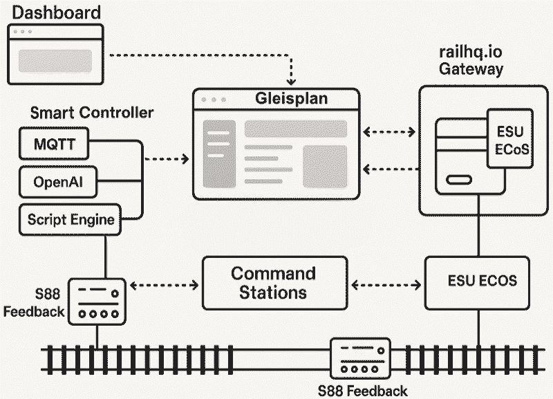

# Architektur & allgemeine Beschreibung

Für die sehr Interessierten von Euch folgt auf dieser Seite eine Basisschreibung des `railhq.io`-Aufbaus, so dass ihr grob wisst worauf ihr euch einlasst.

Eingangs ein grob gefasstes Schaubild wie der aktuelle Aufbau vorgenommen wurde, auch schon mit Hinweisen was noch alles folgen wird und schon in Arbeit ist, u.a. Skript-Engine, Support für OpenAI (ChatGPT) zur sprachlichen Steuerung eurer Anlage, und vieles mehr!

## Systemarchitektur der cloudbasierten Modelleisenbahnsteuerung `railhq.io`

Die Architektur deiner Modelleisenbahn-SaaS-Plattform basiert auf einem modularen, serviceorientierten Ansatz, der sowohl Skalierbarkeit als auch Erweiterbarkeit sicherstellt. Die Lösung richtet sich an Hobby- und Semiprofessionelle Anwender und vereint moderne Webtechnologien mit direkter Hardwareintegration über ein dezentrales Gateway-Modell. Das System lässt sich in mehrere Hauptkomponenten gliedern:

### 1. Landing Page

Die Landing Page dient als Einstiegspunkt für neue Nutzer. Sie ist schlank gehalten und erfüllt primär Marketing- und Registrierungszwecke. Von hier aus gelangen neue Anwender entweder zur Registrierung oder zur Informationssammlung über Funktionen und Systemanforderungen.

### 2. Dashboard (Web-Frontend für den Nutzer)

Das Dashboard ist das Herzstück der Nutzeroberfläche. Es ermöglicht das visuelle Editieren von Gleisplänen, das Beobachten von Zuständen der Anlage in Echtzeit (Condition Monitoring), das Verwalten von Lokomotiven, Weichen, Signalen und ganzen Betriebsabläufen. Darüber hinaus ist es der Ort, an dem Konfigurationen vorgenommen, Scripte erstellt sowie neue Erweiterungsmodule (z. B. Lichtsteuerung, Kameraansichten, Wartungsverwaltung) bedient werden können.

:::info

Wichtig: Das Dashboard ist **kein Steuerungselement**, sondern nur das Tor zu `railhq.io` und somit als Überblicksseite zu sehen. Die Steuerungslogik läuft vollständig im Smart Controller.

:::

### 3. `railhq.io - Gateway` (lokale Komponente beim Anwender)

Das `railhq.io - Gateway` ist eine Desktop-Software, die lokal beim Anwender installiert wird. Es bildet die Brücke zwischen der lokalen Hardware (Command Stations, Rückmelder) und dem cloudbasierten Smart Controller. Es überträgt Statusmeldungen und Befehle, aber führt selbst keine Logik aus.

Unterstützte Hardware aktuell:

- **Steuerungssysteme (Command Stations):**
  * ESU ECoS (DCC, MFX, Selectrix, Märklin Motorola)

- **Rückmeldesysteme (Feedback):**
  * LDT HSI-88-USB
  * ESU ECoS-Rückmeldeeingänge (S88-Bus-Anschluss an der ECoS-Rückseite)
  * ESU ECoSDetector (nutzt ECoSlink)

Die Kommunikation zwischen Gateway und Smart Controller erfolgt bidirektional, TLS-verschlüsselt, und enthält Identitäts- und Rechtemanagement.

### 4. Command Stations

Die Command Stations (z. B. ESU ECoS) sind die physischen Steuerzentralen der Modelleisenbahnanlage. Sie empfangen Fahrbefehle, schalten Weichen und Signale, lesen Sensordaten über S88-Rückmelder ein und agieren direkt auf der Anlage. Sie sind physisch mit dem `railhq.io - Gateway` verbunden – **nicht direkt mit dem Smart Controller oder dem Dashboard**.

### 5. S88-Rückmeldesystem

Diese Feedbackmodule liefern Informationen über Zugbewegungen auf der Anlage (z. B. Gleisbesetzung). Je nach Anlagendesign können diese Rückmelder direkt an die Command Station oder das Gateway angeschlossen werden. Die Daten gelangen über das Gateway zum Smart Controller zur Auswertung.

### 6. Smart Controller (zentrales cloudbasiertes Steuerzentrum)

Der Smart Controller ist die zentrale Instanz für Steuerung und Logik. Er empfängt Sensordaten, analysiert den Zustand der Anlage, führt Automatisierungen aus und erstellt Fahrbefehle, die über das Gateway an die Command Stations übermittelt werden. Der Controller ist modular aufgebaut und erweiterbar über mehrere Schnittstellen:

- **Script Engine** – Nutzer können eigene Automatisierungsskripte schreiben (z. B. JavaScript), die im Smart Controller ausgeführt werden. (seit Juni 2025 verfügbar)

- **MQTT-Unterstützung** – Ermöglicht die Integration von IoT-Komponenten, z. B. zur Steuerung von Lichtern, Kameras oder anderen Smart-Home-Elementen. (seit Juni 2025 verfügbar)

- **API-Schnittstelle** – für die Integration externer Dienste, Apps und Plugins. (seit Juni 2025 verfügbar)

- **OpenAI-Integration** (in Planung) – Optional kann die Anlage durch Sprachbefehle oder KI-gesteuerte Automatik ergänzt werden.

## Zukunftsausblick & Module in Vorbereitung

Wir planen das System modular weiterzuentwickeln. Bereits in der Vorbereitung bzw. konzipiert sind:

* **Modularer Schattenbahnhofbetrieb** – Skriptlos steuerbar mit einer Ereignislogik pro Aufstellblock. (verfügbar)

* **Kamera-Integration** – Für Live-Ansichten der Anlage. (seit Juni 2025 verfügbar)

* **Licht- & Gebäudeautomation** – Per MQTT steuerbar. (seit Juni 2025 verfügbar)

* **Multiuser-Modus & Rechteverwaltung** (in Planung)

* **Marktplatz für Automatikskripte** (in Planung) – Nutzer können eigene Automatisierungen teilen und verwenden.

* **Fuhrparkverwaltung** (in Planung) – Mit Wartungsintervallen, Zustandsdaten und Zubehörverwaltung.
