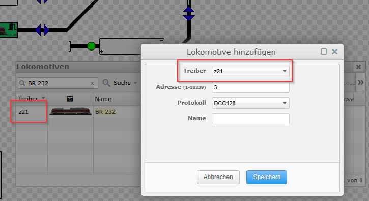
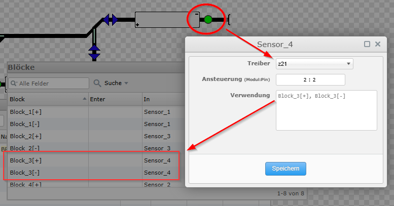
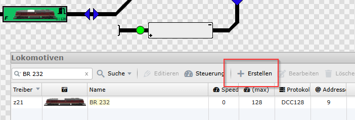
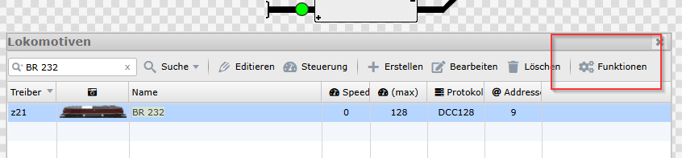
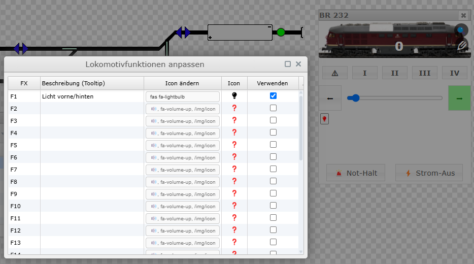
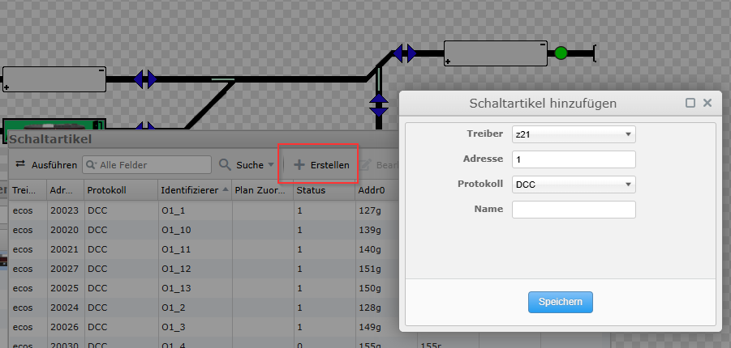
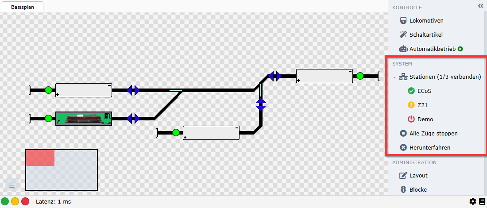
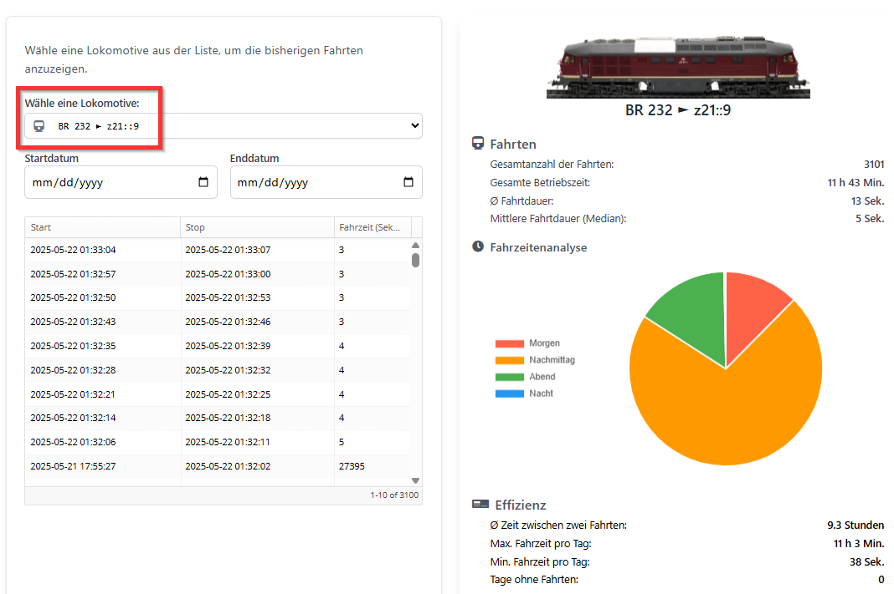

# Roco / Fleischmann

`railhq.io` unterstützt die Roco z21 umfassend und übernimmt dabei die Verwaltung des rollenden Materials vollständig selbst. Für diesen Zweck wurden spezielle UI-Elemente und Dialoge entwickelt, die eine komfortable und intuitive Bedienung ermöglichen. Diese Oberfläche wird kontinuierlich um weitere Einstellungsmöglichkeiten ergänzt. Auch zusätzliche Statistiken und Funktionen werden bei Bedarf umgesetzt, um den Funktionsumfang der z21 optimal zu erweitern und euch als Anwender bestmöglich zu unterstützen.

## Rückmeldung

`railhq.io` unterstützt die Z21 DETECTORs (Art.-Nr. 10808) vollständig im Rahmen ihrer Belegtmeldungsfunktion. Die Anbindung erfolgt wahlweise über R-BUS oder CAN-Bus und ist damit kompatibel mit der schwarzen Z21, der weißen z21 sowie der z21start.

In `railhq.io` erfolgt die Adressierung der Rückmelder konsequent nach dem klaren Schema „Modul:Pin“. Dies ermöglicht eine eindeutige und übersichtliche Zuordnung der Rückmelder in der Gleisplan-Logik und vereinfacht die Einrichtung erheblich.

Die RailCom®-Unterstützung – insbesondere die Lokidentifikation über den CAN-Bus – ist derzeit noch nicht aktiv, befindet sich aber in konkreter Planung. Sie wird zeitnah sowohl für die z21 als auch für die ESU ECoS nachgereicht, um künftig eine präzise Lokverfolgung und erweiterte Diagnosefunktionen zu ermöglichen.

Bereits jetzt lassen sich die Rückmeldungen aus den Z21 DETECTORs in `railhq.io` direkt für Automatisierungen, Fahrstraßen und andere logikbasierte Steuerungen nutzen.

## Lokomotiven und Schaltartikel

Im Zusammenspiel mit der z21 erfolgt die Verwaltung von Lokomotiven und Schaltartikeln derzeit manuell über `railhq.io`. Das bedeutet: Die entsprechenden Daten werden direkt in der Benutzeroberfläche von `railhq.io` angelegt und gepflegt. Dies ist notwendig, da die z21 keine eigene Artikelverwaltung besitzt, sondern primär als „Adapter“ zwischen Steuergerät und Modelleisenbahn fungiert.

Im Gegensatz dazu bietet die ESU ECoS eine integrierte Verwaltung für Lokomotiven und Schaltartikel. `railhq.io` nutzt diese Struktur und synchronisiert die Daten automatisch mit der ECoS – Änderungen an der Zentrale und in `railhq.io` bleiben somit stets konsistent. Dieser Unterschied spiegelt sich in der täglichen Nutzung wider: Während bei der ECoS viele Informationen direkt übernommen werden, ist bei der z21 aktuell noch ein manueller Pflegeaufwand erforderlich.

Langfristig ist geplant, auch für z21-Nutzer eine noch komfortablere Lösung zu schaffen, um den Verwaltungsaufwand weiter zu reduzieren.

### Lokomotiven

Im Zusammenspiel mit der z21 erfolgt die Verwaltung von Lokomotiven in `railhq.io` aktuell manuell, der Aufwand ist jedoch bewusst gering gehalten. Mit einem Klick auf „Erstellen“ im Lokomotiven-Dialog kann eine neue Lok angelegt werden. Der Treiber „z21“ ist dabei bereits vorausgewählt – es müssen lediglich die DCC-Adresse, das verwendete Protokoll sowie ein beliebiger Name angegeben werden. Letzterer wird anschließend konsequent in allen relevanten Bereichen von `railhq.io` verwendet.

Beim Hinzufügen prüft das System automatisch, ob bereits ein Eintrag mit derselben Adresse und demselben Protokoll existiert. In solchen Fällen wird der Nutzer direkt auf mögliche Duplikate hingewiesen, um doppelte Einträge zu vermeiden.

Im Unterschied zur ESU ECoS, bei der `railhq.io` direkt auf die integrierte Artikelverwaltung zugreift und alle Daten automatisch synchronisiert, dient die z21 primär als Steueradapter. Sie stellt keine eigene Verwaltung von Lokomotiven oder Schaltartikeln bereit – deshalb übernimmt `railhq.io` diese Aufgabe vollständig.

### Funktionen von Lokomotiven

Die Funktionen einer Lokomotive müssen `railhq.io` bekannt gemacht werden. Über die Schaltfläche "Funktionen" im Lokomotiven-Dialog kann dies komfortabel durchgeführt werden.

Auch hier versuchen wir den Prozeß so einfach wie möglich zu halten. Es gibt zahlreiche Standardauswahlmöglichkeiten die man mit einem Mausklick auswählen kann; relevante Eingabefelder werden sogleich mit passenden Standardwerten gefüllt.

Alle Eingaben lassen sic jederzeit anpassen und an die eigenen Bedrüfnisse angleichen.

### Schaltartikel

Schaltartikel werden durch einen ähnlichen Eingabedialog, wie er für Lokomotiven verwendet wird, angelegt.

## Gleisplaneditor

Die relevanten Bereiche im Gleisplaneditor wurden entsprechend angepasst, so dass zielgerichtet auf die unterschiedlichen Zentralen eingegangen werden kann.

Einzelne Klicks auf die jweiligen Namen der Zentralen schalten die Verwendung `ein / aus`. 

Aktuell gibt es drei verschiedene Indikatoren:

- (a) grün: Zentrale erreichbar und angeschaltet (Stromzufuhr zum Gleis ist aktiv!)
- (b) gelb: Zentrale nicht erreichbar
- (c) rot: Zentrale ist erreichbar und ausgeschaltet (keine Stromzufuhr zum Gleis)

## Dashboard & Statistiken

Die Auswahl- und Informationsbereiche rund um die Lokomotiven wurden in railhq.io gezielt überarbeitet, um die Bedienung noch intuitiver zu gestalten. Alle relevanten Anzeigen wurden so angepasst, dass auf einen Blick erkennbar ist, welche Lokomotive gerade genutzt wird und welche Zentrale die Steuerdaten liefert.

Diese visuelle Klarheit erleichtert nicht nur die tägliche Arbeit, sondern sorgt auch dafür, dass selbst bei umfangreichen Anlagen stets der Überblick gewahrt bleibt – ganz ohne langes Suchen oder Nachfragen.

