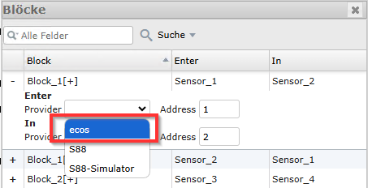
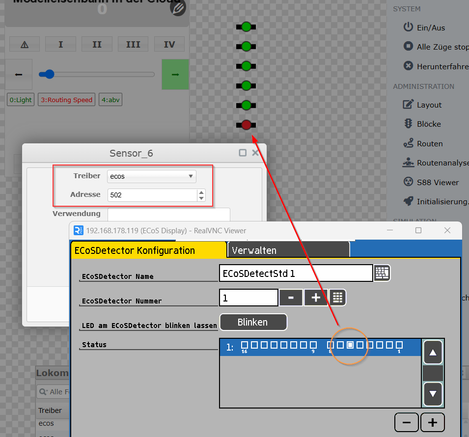
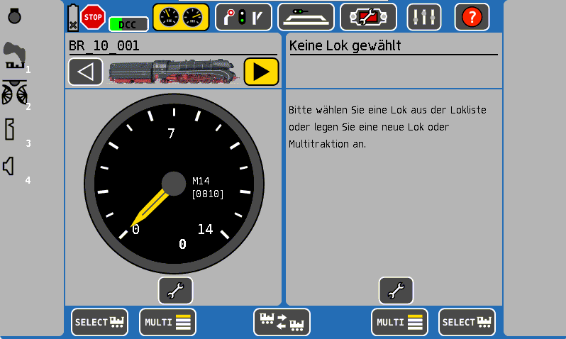
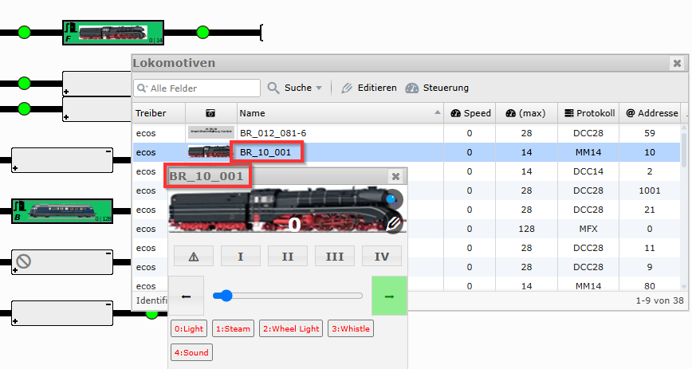
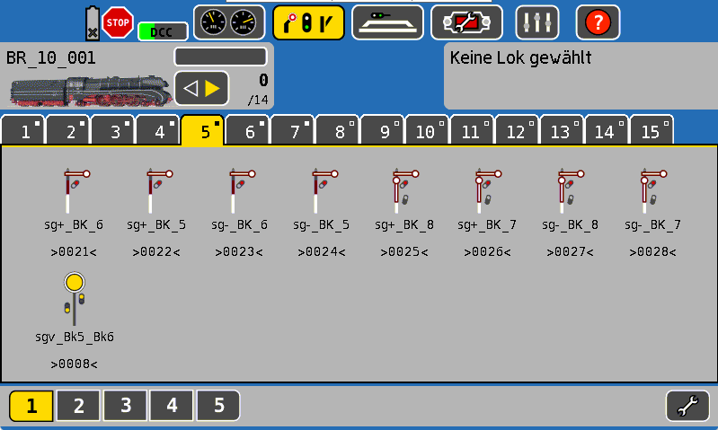
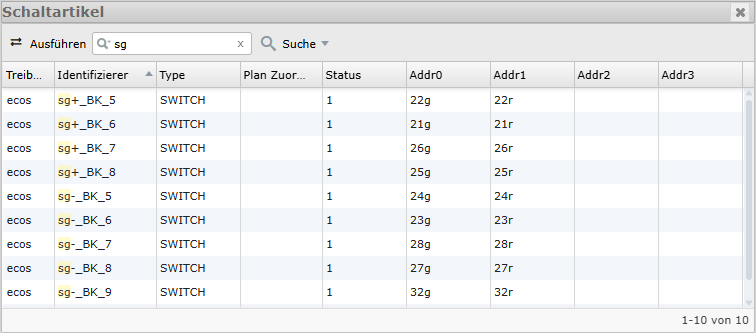
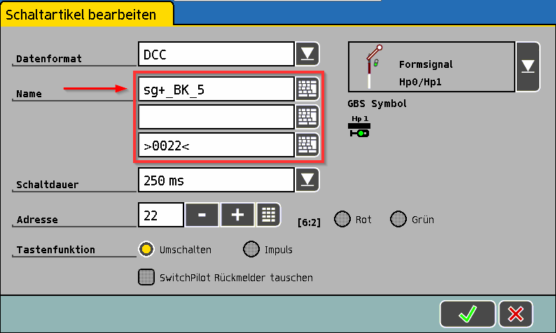

# ESU

`railhq.io` unterstützt von Anfang an die ESU CommandStations. Dabei wurde besonderer Wert auf einfache und durchdachte Konzepte gelegt, um den Verwaltungsaufwand für rollendes Material und Schaltartikel so gering wie möglich zu halten. Unser Ziel bei `railhq.io` war es stets, doppelte Arbeit zu vermeiden und die Datenhaltung weitgehend den CommandStations selbst zu überlassen – damit diese auch langfristig als zentrale Steuerung genutzt werden können.

## Rückmeldung

`railhq.io` unterstützt das Rückmeldesystem der ECoS-Reihe. Für die Nutzung müssen die entsprechenden Einstellungen vorgenommen werden und ein passender Treiber ausgewählt werden, hier **ecos**:

### `railq.io` mit ECoS S88-Bus

`railhq.io` unterstützt seit seiner Erstveröffentlichung den **s88**-Bus den man über die sechspolige Stiftleiste hinter der ECoS mit Märklin s88-kompatiblen Rückmeldemodulen nutzen kann, bis zu 32 Module sind möglich. Parallel zum s88-Bus können zusätzlich oder ausschließlich ECoSDetectors von ESU genutzt werden.

### `railhq.io` mit ECoSDetector

Ab Version `1.26` des `railhq.io - Gateway` werden die ESU Detektoren für die Rückmeldung unterstützt. Hierbei ist zu beachten, dass die Adressierung mit einem Offset arbeitet (siehe unten)

In der aktuellen Konfiguration werden die ECoS-Detektoren physikalisch hinter dem S88-Bus eingebunden. Dadurch ergibt sich eine feste Adressstruktur: Die Ports 1 bis 31 sind für S88-Module reserviert, um die maximale Anzahl möglicher S88-Geräte abzudecken.

Die ECoS-Detektoren beginnen folglich bei Port 32, was intern zur Startadresse 497 führt. Diese Adressierung ist technisch bedingt und ermöglicht eine einfache Erweiterung, ohne zusätzlichen Implementierungsaufwand.

Die Adresszuweisung erfolgt somit wie folgt:

* ECoS-Detektor 1, Pin 1 → Adresse 497

* ECoS-Detektor 1, Pin 2 → Adresse 498

* ECoS-Detektor 1, Pin 3 → Adresse 499

* ECoS-Detektor 1, Pin 4 → Adresse 500

* ECoS-Detektor 1, Pin 5 → Adresse 501

* ECoS-Detektor 1, Pin 6 → Adresse 502

* (usw.)

Diese Konvention stellt sicher, dass S88-Module und ECoS-Detektoren im System konfliktfrei und durchgängig adressiert werden können.

## Namensgebung

Zu euch als Anwender arbeitet `railhq.io` hauptsächlich mit Namen, anstatt mit den internen IDs der jeweiligen CommandStations. Intern in der `railhq.io`-Umsetzung wird eine Kombination aus **\{Treibername\}::\{ECoS-ID\}** und **ECoS Entität-Name** genutzt, das seht ihr gleich.

### Lokomotiven

Zur Verdeutlichung zeigt das nachfolgende Screenshot die Auswahl der Lokomotive **BR_10_001**, eben diesen Namen findet ihr auch konsequent in allen UI-Teilen (also Benutzerschnittstellen) von `railhq.io`.

Hier im interaktiven Gleisplan seht ihr die Verwendung der Lokomotive mit entsprechender Benennung:

### Schaltartikel

Gleicher Ansatz bei Schaltartikeln. Der Name wird nach außen kommuniziert um das Handling für euch einfacher zu gestalten. 

Beispielweise für das Signal **sg+_BK_5**, welches hier in der Liste entsprechend aufgeführt wird:

Auch das ESU ECoS Kommunikationsprotokoll wird pinzipiell durchgeschleift. Wem das Protkoll bekannt ist, der erkennt die Adressierung entsprechend wieder. Hier wird nicht direkt mit den entsprechenden DCC-Adressen gearbeitet, dieses Handling überlassen wir der ECoS, wir verwenden die assoziativen Adressierungen und senden Befehle mit **22g** für das Schalten auf **GRÜN** oder **22r** für das Schalten auf **ROT**.

:::warning

Obacht, es ist möglich drei Zeilen für den Namen eines Schaltartikel einzugeben. `railhq.io` nutzt allerdings nur den ersten Eintrag! Im nachfolgenden Screenshot sind drei Zeilen vorhanden, zwei genutzt (die erste und letzte Zeile), aber für uns bei `railhq.io` ist nur der erste Eintrag von Relevanz.

:::

