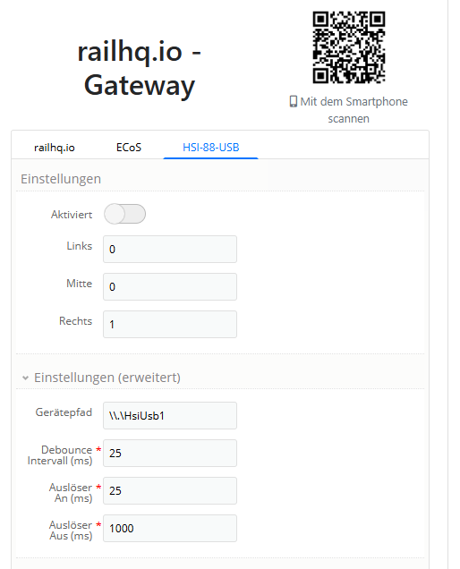

# HSI

`railhq.io` unterstützt vom Beginn an die HSI-88-USB Schnittstelle für die S88-Rückmeldebausteine.

Grundsätzlich gibt es zwei Möglichkeiten das HSI-88-USB in Kombination mit `railhq.io` zu nutzen:

- Direkt über den USB-Anschluss des Computers, an dem das HSI-88-USB angeschlossen ist. **Linux-Systeme sind hierbei jedoch ausgeschlossen**, da der Hersteller bislang keine offiziellen Treiber für diese Plattform bereitgestellt hat.

- Alternativ ist auch die Nutzung eines Software-Proxys möglich, der von einem Teammitglied von `railhq.io` zur Verfügung gestellt wird – dem sogenannten RocrailHsi88UsbProxy. Der Name stammt noch aus Zeiten, in denen Rocrail verwendet wurde; heute würden wir eine neutralere Bezeichnung wählen.

## USB-Anschluss

### 🔌Hinweis zum USB-Anschluss und dessen Support

Für Informationen zum USB-Anschluss und dessen Unterstützung verweisen wir auf die Dokumentation des jeweiligen Herstellers. Wir gehen davon aus, dass Nutzerinnen und Nutzer, die über entsprechende Hardware verfügen, wissen, wie sie an die relevanten Informationen gelangen.

Die direkte USB-Verbindung ist **nur unter Windows** möglich, da der Hersteller nach aktuellen Stand (11. April 2025) **keine offiziellen Treiber für Linux** bereitgestellt hat.

### 🛠️ Konfiguration über das `railhq.io - Gateway`

1. Öffne die Konfiguration deines Gateways.
2. Wechsle zum Reiter **„HSI-88-USB“**.
3. Klappe den Bereich **„Einstellungen (erweitert)“** auf.
4. Trage die gewünschte USB-Schnittstelle ein.
5. (optional) Passe die Abtastraten für  
   - **„Debounce“**  
   - **„Auslöser AN“**  
   - **„Auslöser AUS“**  
   an, um die Reaktionszeiten für Statusänderungen im Gateway zu steuern.

💡 *Nur tatsächliche Änderungen werden an* `railhq.io` *übermittelt – für geringe Datenmengen, bessere Performance und minimale Latenzen.*

## 🧰 Alternative: Software-Proxy (**RocrailHsi88UsbProxy**)

Alternativ ist auch die Nutzung eines Software-Proxys möglich, der von einem `railhq.io`-Teammitglied bereitgestellt wird – der sogenannte **RocrailHsi88UsbProxy**.  
> 🧑‍💻 *Der Name stammt noch aus der Zeit mit Rocrail; heute würden wir ihn neutraler benennen.*

🔗 **Open Source & Download:**  
[📦 GitHub – RocrailHsi88UsbProxy](https://github.com/cbries/RocrailHsi88UsbProxy)

🧬 **Funktionsweise:**  
Der Proxy fungiert als **Man-in-the-Middle** zwischen dem `railhq.io - Gateway` und deiner **ESU ECoS**. Dabei ersetzt er den normalen Rückmeldeverkehr durch die Rückmeldungen des **HSI-88-USB**.

### Kommunikationsarchitektur

Der nachfolgende Screenshot soll das Man-in-the-Middle Prinzip für diesen Proxy veranschaulichen. Es zeigt was an welchen Stellen innerhalb des Kommunikationsprotokoll ausgetauscht wird.

