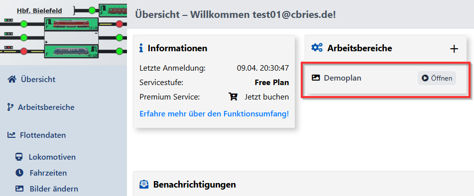
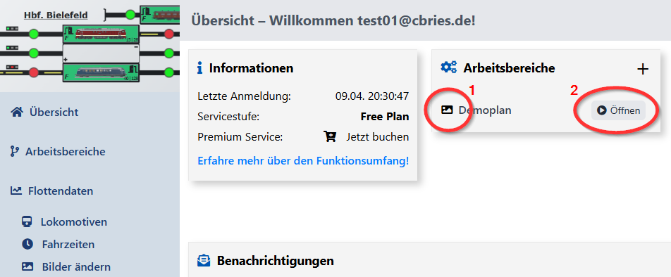
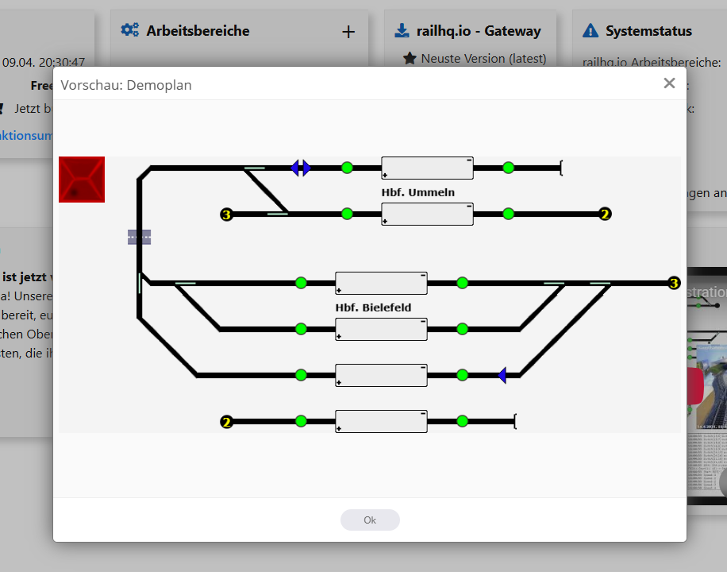
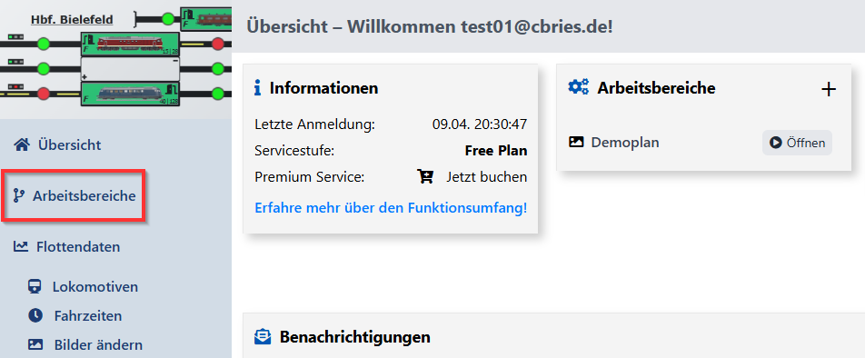
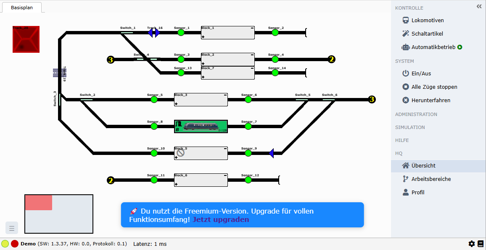
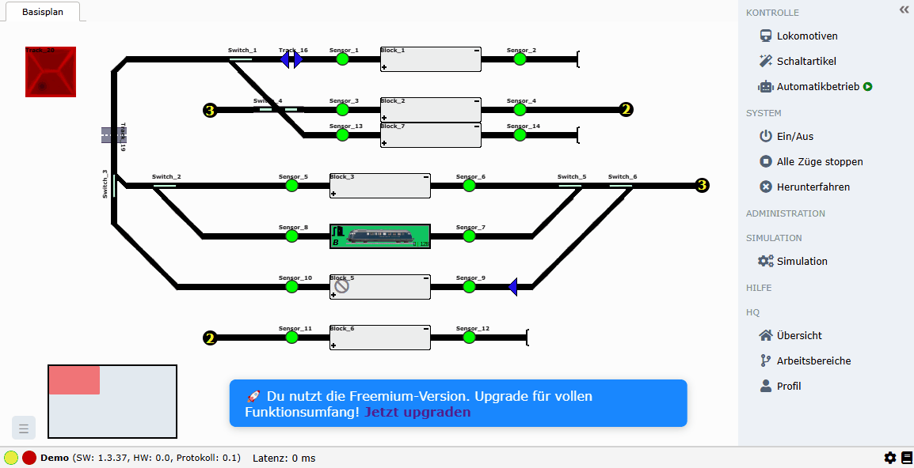
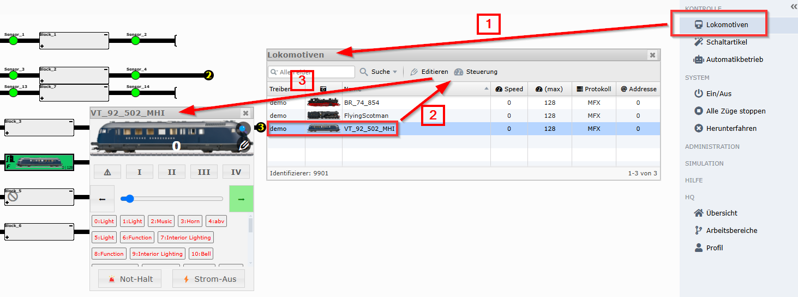
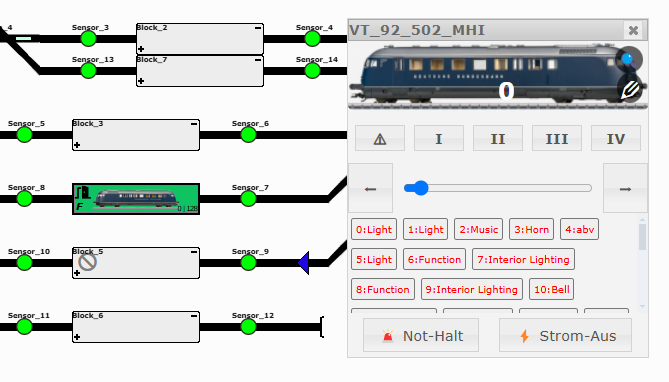
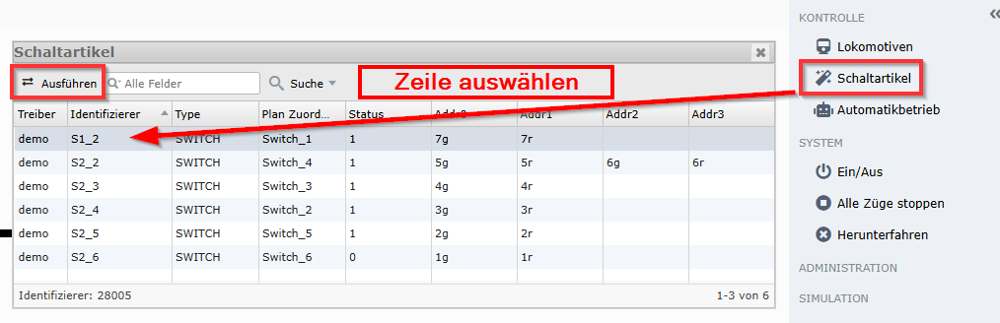
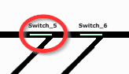

# Tutorial - Einleitung

Auf dieser Seite wirst du die Mindestinformationen erhalten um schnell einen Einstieg zur Steuerung deiner Modelleisenbahn mit `railhq.io` zu erhalten.

## Los geht's!

Ziel dieser Starthilfe ist es, dich in kürzester Zeit deinen ersten Zug fahren zu lassen. Dabei lernst du direkt die wichtigsten Grundkonzepte kennen – und verstehst, wie alles zusammenhängt.

### Was du brauchst

- [Benutzeraccount](https://railhq.io/auth/register) Falls du das noch nicht getan hast, benötigst du zunächst einen kostenlosen Benutzeraccount. Damit kannst du deine Anlagen erstellen und jederzeit darauf zugreifen sowie sie steuern.

- [railhq.io - Gateway](https://railhq.io/downloads) Optional kannst du auch jetzt schon das `railhq.io – Gateway` installieren.
Es ermöglicht dir, deine Modelleisenbahn mit `railhq.io` zu verbinden – so kannst du sie von überall und jederzeit über Computer, Tablet oder Smartphone steuern.

Das war’s auch schon — ein einfacher Benutzeraccount reicht völlig aus, um `railhq.io` in vollem Umfang zu testen.

Nach erfolgreicher Registrierung und Anmeldung landest du direkt in der Übersicht (Dashboard).

## Übersicht (Dashboard)

Die Übersicht (auch **Dashboard** genannt) ist der direkte Einstiegspunkt in dein neues Modelleisenbahnerlebnis.

Standardmässig ist ein Demoplan hinzugefügt worden, diesen kannst du sofort öffnen und nutzen.

Zur Erläuterung:

Der nachfolgende Screenshot zeigt zwei Kreise, beschriftet mit **1** und **2**.

**(1)** Dies ist ein Button, der eine Bildvorschau des Gleisplans anzeigt.
Besonders praktisch bei mehreren Gleisplänen in unterschiedlichen Varianten – so findest du schneller den passenden Plan.

**(2)** Mit diesem Button gelangst du zum interaktiven Gleisplan.
Dort kannst du ihn direkt nutzen oder nach deinen Bedürfnissen anpassen.

Die Vorschau deines jeweiligen Gleisplan kannst du zu jedem Zeitpunkt neu erstellen, dies geht direkt im interaktiven Gleisplaneditor. (siehe auch [Gleisplanvorschau](./tutorial-basics/gleisplan-overview.md#gleisplanvorschau))

Die Vorschau sieht wie folgt aus:

Über den Menüpunkt Arbeitsbereiche in der linken Navigationsleiste gelangst du zur Übersicht aller bisher erstellten Gleispläne.
Dort findest du außerdem weitere Informationen zu jedem Plan – probier es einfach mal aus!

## Erster Automatikbetrieb

Klicke auf Öffnen, um zum interaktiven Gleisplan weitergeleitet zu werden.
Wenn du einen neuen Gleisplan erstellen möchtest, kannst du das über das + (rechts oben, neben „Arbeitsbereiche“) tun – dazu kommen wir später noch.

Nach dem Öffnen siehst du den folgenden Gleisplan:

Für besonders eifrige Nutzer: Mit einem Klick auf Simulation / Simulation und anschließend auf Automatikbetrieb kannst du das Spielerlebnis sofort starten.

Das Screencast zeigt, wie schnell der Automatikbetrieb in der Demo gestartet und genutzt werden kann.

`railhq.io` basiert auf einer Blocksteuerung, bei der jeder Block mindestens einen Rückmelder benötigt. Ideal ist es, zwei Rückmelder zu verwenden: einen für die Einfahrt in den Block und einen weiteren für das Erreichen der Endstelle im Block.

Mit einem weiteren Klick auf "Automatikbetrieb" kannst du eben diesen auch wieder beenden.

## Lokomotivauswahl/-steuerung

Über den Menüpunkt "Lokomotiven" kommt man zur Lokomotivauswahl, daraufhin kann man nach Auswahl einer Lokomotive diese über "Steuerung" (oder mit Doppelklick auf die Zeile) öffnen.

In der Lokomotivauswahl kann man die gewählte Lokomotive gewohnt steuern. Es kann die Fahrtrichtung, Fahrtgeschwindikeit und unterschiedliche Funktionen bedient werden.

## Schaltartikel

Die Schaltartikel können über die Schaltfläche "Schaltartikel" ausgewählt werden. Nach dem Auswählen einer Zeile kann dieser Schaltartikel über "Ausführen" durchiteriert werden.

Die Schaltartikel (Weichen, Signale, Schaltknöpfe, u.a.) können direkt im Gleisplan angewählt und geschaltet werden.

Probiere es einfach mal aus!

