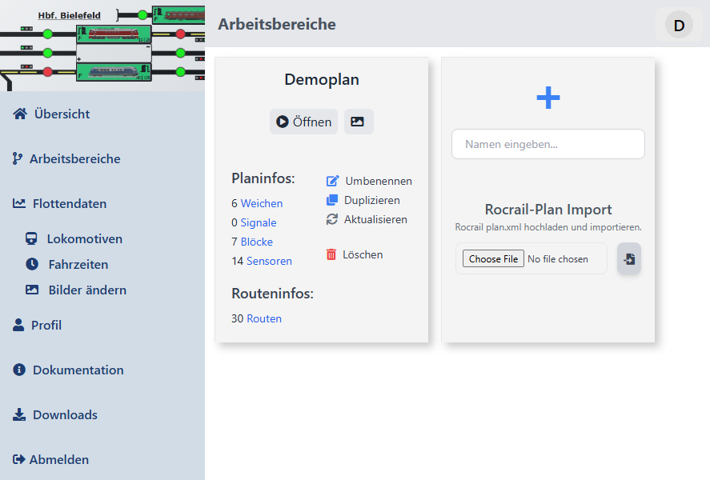
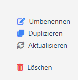
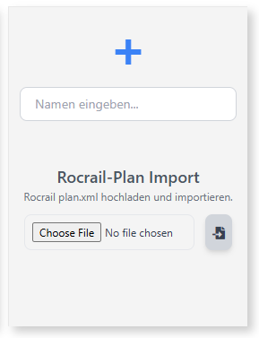
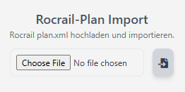

# Arbeitsbereiche

Mit einem Klick auf "Arbeitsbereiche" kommst du in die Gesamtansicht aller von dir erstellten Gleispläne. Jede einzelne Kachel im Hauptbereich dient dabei als Informationsquelle für den Gleisplan selbst. Die Basisaktionen wie "Öffnen" und "Vorschau" sind obligatorisch (siehe auch [Übersicht](../intro#übersicht-dashboard))

## Informationen eines Gleisplan

Die Grundinformationen die dir zur Verfügung gestellt werden, sind:

- Anzahl der hinzugefügten Weichen
- Anzahl der Signale
- Anzahl der Blöcke (`railhq.io` nutzt einen Blockansatz zur Automatisierung)
- Anzahl der Sensoren für die Rückmeldung der Lokomotiv-Positionen
- Anzahl der möglichen Routen, also welche Strecken eine Lokomotive / ein Zug wählen kann um von A nac B zu kommen

## Aktionen zu einem Gleisplan

`railhq.io` bietet dir die klassichen Funktionen, wie:

- "Umbenennen": damit du jeden Gleisplan individuell benennen kannst
- "Duplizieren": damit du u.a. für Testzwecke einen Gleisplan schnell duplizieren und anpassen kanns
- "Aktualisieren": wird verwendet um die **Planinfos** zu erneuern (dies passiert nicht automatisch)
- "Löschen": damit du in deinem Arbeitsbereich Ordnung schaffen kannst und alte, nicht mehr genutzte Gleispläne löschen kannst.

:::info

Das Löschen eines Gleisplans passiert nicht sofort. Das Löschen muss erst von dir durch die Beantwortung einer Aufgabe in einem Dialog erfolgreich freigeschaltet werden.

:::

## Gleisplan erstellen

`railhq.io` bietet aktuell die Möglichkeit direkt einen Gleisplan mit einem Namen neu zu erstellen. Gebe dafür einfach einen frei wählbaren Namen in das entsprechende Feld ein und bestätige deine Eingabe durch *&lt;Enter&gt;* mit der Tastatur oder mit einem Mausklick auf das große "+" (Plus).

## Gleisplan importieren

Um den Übergang von bekannter Steuerungssoftware zu `railhq.io` zu vereinfachen, bieten wir dir die Möglichkeit schon erstellte Gleispläne (z.B. von Rocrail) zu importieren.

Klicke einfach auf "Dateiauswahl" (Choose File), wähle die Hauptdatei deines bisherigen Gleisplans für die jeweilige Steuerungsosftware und dann auf den Button rechts, dein Plan wird importiert. Ob dies gelingt wird durch entsprechende Meldung veranschaulicht. Nach dem Import solltest du den Import prüfen und gegebenenfalls an deine Bedrüfnisse anpassen. 

:::warning

Der Import dient nur als Starthilfe um bisher genutzte Gleispläne schneller innerhalb von `railhq.io` an den Start zu bringen. Der Import ersetzt keine vollumfängliche Planun und Umsetzung deiner Modelleisenbahnsteuerung.

:::
