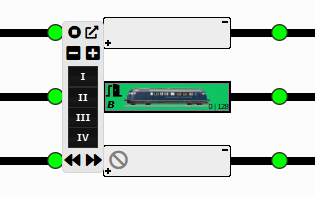
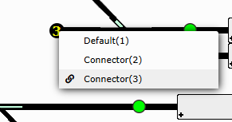
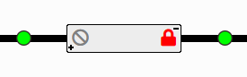
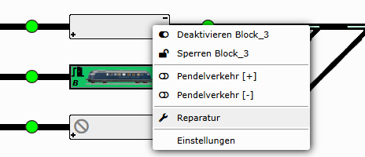
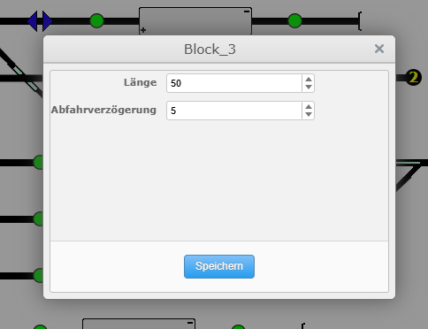
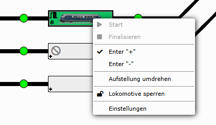
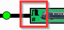
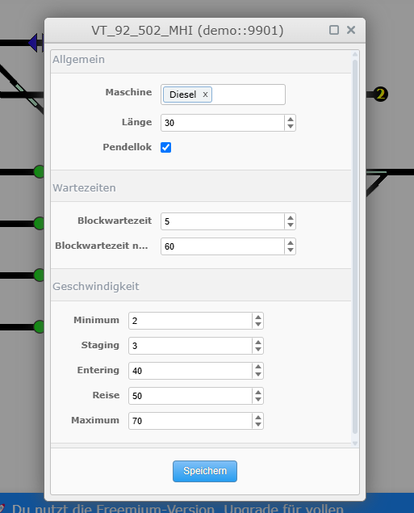
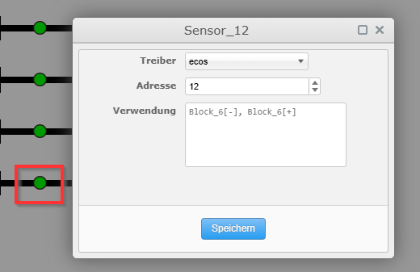
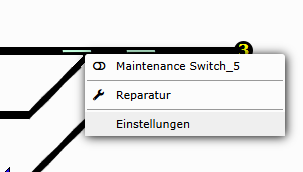

# Bedienung

Wir versuchen die Bedienung so einfach wie möglich zu halte. Bei Ideen zur Verbesserung kannst du uns gerne eine Nachricht zukommen lassen und wir werden versuchen deine Ideen harmonisch umzusetzen.

## Lokomotivensteuerung

Wenn du mit der Maus über einen Block mit zugewiesender Lokomotive gehst, so zeigt sich nach wenigen Millisekunden ein Submenü. Dieses Submenü ist ein Kleinform des größeren Steuerungsdialog mit dem du die grundlegensten Steuerungsbfehle ausführen kannst:

- Stop
- Wechsel zwischen Vortwärtsfahrt und Rückwärtsfahrt
- Erhöhung/Verringerung der aktuellen Geschwindigkeit
- Auswahl der vordefinierten Geschwindigkeiten

## Konnektoren

Wenn du in deinem Gleisplan Konnektoren verwendest, also Gleisstücke die virtuell miteinander verbunden sind, so kannst du diese Verbindung direkt über ein Kontextmenü anpassen. Jeweils zwei Konnektoren mit dem gleichen Index werden virtuell miteinander verbunden. 

Die Indezes werden generiert, die maximale Anzahl der Indezes ist `n = Anzahl der Konnektoren / 2 +`, so dass immer eine Paarbildung möglich ist. *Default(1)* ist ein Platzhalter, wenn dieser vergeben ist, so wird der Konnektor bei der Gleisplanung nicht weiter beachtet. Der Konnektor verhält sich dann so wie ein Prellbock.

## Blöcke

Im Kontextmenü eines Block kann dieser Deaktiviert werden, d.h. in einem Automatikbetrieb würde dieser Block nicht angesteuert werden. Wenn der Block gesperrt ist, so wäre es Ausfahrt nicht mehr möglich. Ob ein Block deaktiviert oder gesperrt ist erkennst du visuell an den folgenden zwei Darstellungen:

Im weiteren kann eingestellt werden ob ein Block von links (**[+]**) oder rechts (**[-]**) für Pendelverkehr zugelassen ist. Hier gilt es zu beachten, dass die Möglichkeit des Pendelverkehr nur für die Lokomotiven gilt, welche auch für den Pendelverkehr zugelassen sind.

Beim Laden eines Gleisplan, aber auch bei Editieren des Gleisplan wird kontinuierlich im Hintergrund mit gewissen Heuristiken geprüft ob die Einstellungen noch valide sind. Sollten die Einstellungen nicht valide sein, so wird dies visuell dargestellt um daraufhin eine *Reparatur* zu ermöglichen. Wir versuchen die Reparatur beim Klick auf *Reparatur* automatisch auszuführen, aber diese muss von dir gestartet werden.

Über *Einstellungen* kommst du zu einem erweiterten Konfigurationsdialog

In den Blockeinstellungen kannst du u.a. die Länge des Blocks definieren, oder mit welcher Abfahrtsverzögerung die Lokomotiven abfahren sollen.

:::tip

Wenn dem Block eine Lokomotive zugewiesen ist, so würde das standardmässig das Kontextmenü der Lokomotive angezeigt werden. Halte die Tastaturtaste &lt;Shift&gt; gedrückt und öffne dann das Kontextmenü um das entsprechende Block-Kontextmenü zu erhalten. 

:::

## Lokomotiven und Blöcke

Wenn eine Lokomotive einem Block zugewiesen ist, so passt sich das Kontektmenü automatisch an.

In diesem Menü kann direkt die Einfahrseite der Lokomotive in den Block vorgegeben werden. Ob links (**[+]**) oder rechts (**[-]**) kann dann auch direkt im Gleisplan abgelesen werden. Das kleine Türsymbol zeigt an, auf welcher Seite sich die Lokomotive in den Block bewegt hat.

Die Funktionen *Start* und *Finalisieren* sind nur im Automatikmodus aktiv. *Start* triggert die Weiterfahrt einer Lokomotive ohne auf das Ende der eingestellten Wartezeit zu warten. Beim Finalisieren wird die Lokomotive bis zum Ziel bewegt und daraufhin in den Wartemodus versetzt, so dass diese in weiteren Routenfindungen im Automatikmodus nicht beachtet wird.

Mit *Aufstellung umdrehen* kann die Orientierung der Lokomotive geändert werden. *Lokomotive sperren* sperrt die Nutzung der Lokomotive, Funktionen sind noch aktiv, aber die Lokomotive kann nicht weiter bedient werden.

Über *Einstellungen* gelangst du in den erweiterten Editiermodus.

In diesen Einstellungen kannst du folgende Punkte bearbeiten:

- **Maschine**: die Art der Maschine, z.B. Dieselantrieb oder Dampfmaschine; dies ist für etwaigen Automatikbetrieb gedacht, so dass eine elektrifizierte Lokomotive nicht in Bereiche fährt bei der es keine Oberleitung gibt.

- **Länge**: die Länge der Lokomotive, so dass nur Blöcke angefahren werden, in die die Lokomotive auch passend halten kann

- **Pendellok**: erlaubt das Einfahren in Blöcke mit Pendelerlaubnis; die Einfahrseite in einem Block ist für eine Lokomotive generell irrelevant

- **Wartezeiten**: hier geht es im die Wartezeiten in einem Block, es muss i.d.R. erst mindestens diese Zeit in Sekunden vergangen sein, bevor eine Weiterfahrt möglich ist

- **Geschwindigkeiten**: diese Werte gehen direkt in die Steuerung über, sei es in den Lokomotiv-Steuerungsdialogen mit *I*, *II*, *III* und *IV* oder während des Automatikbetrieb. *Entering* ist die Geschwindigkeit welche direkt übernommen wird, wenn eine Lokomotive einen Blockbereich erreicht.

## Sensoren / Feedback / S88

Die Sensoren haben auch ihr eigenes Kontextmenü über welches du die Adressierung einstellen kannst. Es werden die unterstützten Treiber in einer Auswahlliste aufgeführt, nach der Auswahl des Treiber kannst du die entsprechende Adressierung übernehmen.

## Schaltartikel

Auch die Schaltartikel können über das Kontextmenü passend für die eigene Anlage eingestellt werden.

Über den Punkt *Wartung* (*Maintenance*) kann ein Schaltartikel in den Wartungsmodus gesetzt werden. Alle Routen die diese Weiche erfordern werden dann bei der Automatisierung übersprungen und nicht bedient, so dass trotz Wartung der Spielspaß im Fordergrund steht.

