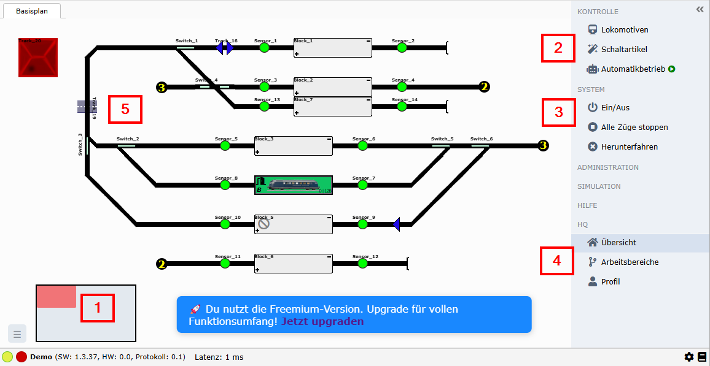
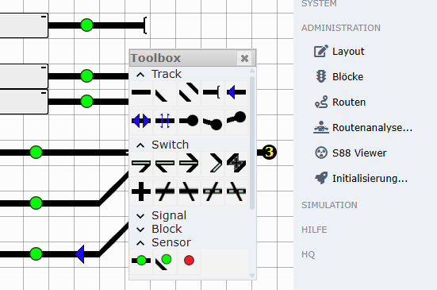
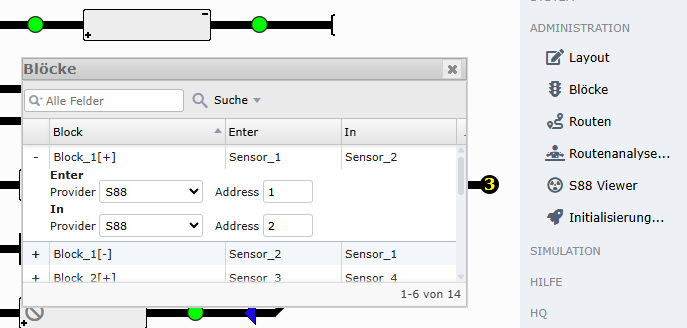
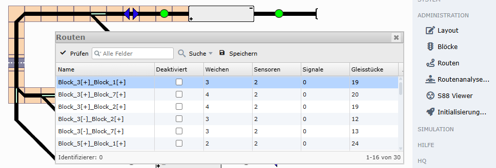
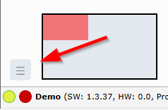
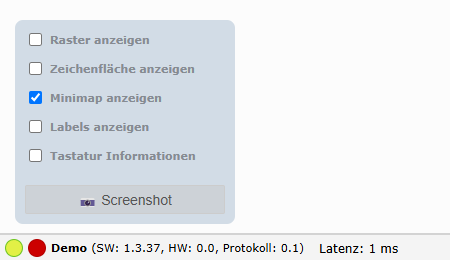
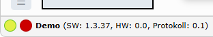
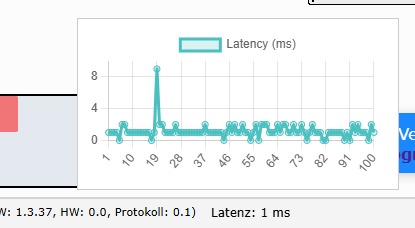
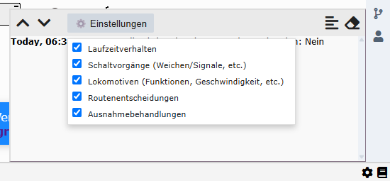

# Interaktiver Gleisplan

## Übersicht im Gleisplan

**(1)** Die Minimap dient dazu, die Ansicht des Gleisplans zu verschieben. Der Gleisplan selbst befindet sich innerhalb eines Rechtecks mit festgelegter Größe. Die Ansicht lässt sich per Maus bequem verschieben.

**(2)** Dies dürften die am häufigsten genutzten Funktionen sein: Hier kannst du direkt den Dialog zur Lokomotivauswahl öffnen und einzelne Lokomotiven gezielt steuern. Gleiches gilt für die verfügbaren Schaltartikel. Mit dem Schalter „Automatikbetrieb“ lässt sich die Automatik bequem ein- oder ausschalten.

**(3)** „Ein/Aus“ aktiviert bzw. deaktiviert den Bahnstrom. Die zweite Schaltfläche stoppt alle Lokomotiven, indem ihre Geschwindigkeit auf null gesetzt wird. Mit „Herunterfahren“ wird deine aktuelle Zentraleinheit (z. B. eine ESU ECoS) ordnungsgemäß ausgeschaltet.

**(4)** Über diese drei Menüpunkte gelangst du zurück zum Dashboard, zur Übersicht deiner Arbeitsbereiche (also zur Auswahl eines Gleisplans) und zu deinem persönlichen Benutzerprofil.

**(5)** Dies ist dein interaktiver Gleisplan. Weichen und Signale lassen sich direkt anklicken und steuern dabei deine angeschlossene Hardware. Der dargestellte Status im Plan entspricht dem tatsächlichen Zustand deiner Anlage im eingeschalteten Betrieb.

## Administrationsbereich im interaktiven Gleisplan

Wenn ihr einmal in der rechten Menüleiste auf "Administration" klickt, so öffnet sich ein Untermenü mit den folgenden Bereichen:

- **Layout**: Aktiviert die Editierbarkeit von deinem Gleisplan. Hier kannst du dich austoben.

- **Blöcke**: Alle im Plan hinzugefügten Blöcke werden in diesem Dialog aufgeführt.

- **Routen**: Öffnet einen Dialog der alle Routen auflistet die durch eine "Routenanalyse" gefunden wurden. Die Selektion einer Zeile in dem Dialog hebt die Route im Gleisplan hervor.

- **Routenanalyse**: Eine spannende Funktion, mit einem Klick und der nachfolgenden Bestätigung triggerst du die Analyse deines Gleisplans. Es werden alle erreichbaren Routen zwischen den jeweiligen Blöcken gesucht und nachgelagert im Dialog "Routen" (Klick auf "Routen") aufgelistet. Vorsicht, vorhandene Routen werden gelöscht oder erneuert.

- **S88 Viewer**: Solltest du S88-Feedbacks in verbaut und eingestellt haben, so werden diese in diesem Dialog visualisiert, so dass du recht konfortabel die Adressierung ablesen kannst.

- **Initialisierung**: Es öffnet sich ein Dialog in dem ausgewählt werden kann wie dein Gleisplan oder deine Hardware initialisiert werden soll. Eine Option dient dazu die Hardwareeigenschaften (also die Lokomotiven, Weichen, Signale, etc.) auszulesen und mit `railhq.io` zu synchronisieren. Die zweite Option schaltet einmal alle Schaltartikel durch um einen initialen Zustand zu erreichen. Hierbei ist zu beachten, dass nur die Schaltartikel geschaltet werden, die sich im aktuellen Gleisplan befinden.

## Gleisplanvorschau

Unten kommst du mit einem Klick auf das Burgermenü zu einem Untermenü um spezielle Einstellunen zu machen.

In dem Menü findest du folgende Funktionen:

**(1)** "Raster anzeigen" damit kannst du ein Raster anzeigen, jedes einzelne Rasterfeld hat eine Größe eines Gleisstücks (z.B. einem geraden Gleisstück).

**(2)** "Zeichenfläche anzeigen" zeigt ein Schachbrettmuster, welches man aus gängigen Grafikbearbeitunsprogrammen kennt. Dies soll eine rein visuelle Hilfestellung sein.

**(3)** "Minimap anzeigen" zeigt die Minimap an/aus, mit der der Fokus des Gleisplan variiert werden kann.

**(4)** "Labels anzeigen" zeigt die internen Namen der einzelnen Gleisstücke an, diese werden direkt im Plan angezeigt. Zusatzinfo: Wenn du mit der Maus über den Gleisplan fährst, so werden diese Namen auch unten rechts in der Statusleiste angezeigt, sehr hilfreich bei Konfigurieren der Schaltautomatik.

**(5)** "Tastatur Informationen" zeigt eine kleine Hilfestellung an, die dir sagt wie man den Gleisplan im Editiermodus mit der Tastatur bedienen kann.

**(6)** Mit einem Klick auf "Screenshot" wird ein aktueller Screenshot von deinem Gleisplan erzeugt. Dieser wird das Vorschau in der Gleisplanübersicht verwendet (siehe auch ...).

## Statusleiste

Die Statusleiste ist immer sichtbar und liefert die kurz und prägnant Informationen zur aktuellen Situation. Links werden dir die Status der konfigurierten und zur Verfügung stehenden Controll-/CommandStations angezeigt (z.B. ESU ECoS oder unser Demonstrationstreiber). Rechts von den jeweiligen farblichen Kreisen bekommt du Kurzinformationen zur entsprechenden Hardware:

- **SW**: den **S**oft**w**are-Versionsstand
- **HW**: den **H**ard**w**are-Versionsstand
- die aktuell unterstützte Kommunikationsprotokollversion

**Demo** ist hierbei das von `railhq.io` bereitgestellte Demonstrationssystem, mit dem du einen Gleisplan simulieren kannst. Das Demonstrationssystem stellt direkt einen Gleisplan zur Verfügung und kann sofort zu Testzwecken genutzt werden.

Rechts dieser Informationen wird die aktuelle **Latenz** angezeigt. Dies ist ein Wert in Millisekunden, der dir Informationen zu deiner aktuellen Netzwerverbindung zu `railhq.io` verdeutlicht, je niedriger dieser Wert umso besser!

Mit einem Klick auf diesen Wert erhälst du eine grafische Aufarbeitung der letzten einhundert Messungen.

:::note

Es handelt sich bei dieser Messung um einen vollumfänglich Roundtrip, also die Rundreise eines Steuerungsbefehls. Dieser gemessende Wert ist nicht gleichzusetzen mit einem Ping-Pong aus der Netzwerktechnik. Es wird über eine WebSocket-Verbindung ein Datenpaket an `railhq.io` geschickt, verarbeitet und zurückgesendet. Die Zeit zwischen Absenden und Empfangen wird durch diesen Messwert beschrieben.

:::

Bei dieser Messung handelt es sich um einen vollständigen Roundtrip – also die komplette Reise eines Steuerungsbefehls vom Sender bis zur Rückkehr. Der ermittelte Wert ist **nicht** mit einem klassischen Ping-Pong aus der Netzwerktechnik gleichzusetzen. Stattdessen wird über eine WebSocket-Verbindung ein Datenpaket an `railhq.io` gesendet, dort verarbeitet und anschließend wieder zurückgesendet. Die gemessene Zeit beschreibt die Dauer zwischen dem Absenden des Befehls und dem Empfang der Antwort.

:::warning 

Wenn zu viele Informationen protokolliert und gleichzeitig angezeigt werden, kann dies zu leichten Performanceeinbußen und einem erhöhten Speicherverbrauch führen. Es ist daher Vorsicht geboten. Ihr solltet euch daher nur so viele Informationen anzeigen, die ihr auch wirklich für die Nutzung von `railhq.io` benötigt.

:::
