# Erstellung deines ersten Gleisplan

## Zielsetzung

In diesem Teil werden wir zusammen einen komplett eigenen Gleisplan inklusive Konfiguration und Simulationsmodus umsetzen.

## Erstellung eines Arbeitsbereichs

Wir starten über Dashboard von `railhq.io` und wechseln in die Ansicht der *Arbeitsbereiche*. Dort geben wir in dem Textfeld einen neuen Namen und bestätigen die Eingabe mit &lt;Enter&gt;. Es wird automatisch in den interaktiven Gleisplan gewechselt.

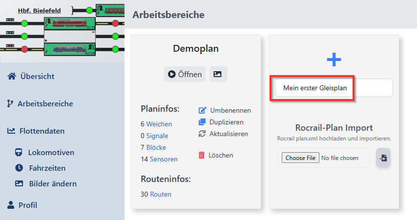

## Startansicht vom Arbeitsbereich

Der Arbeitsbereich begrüßt uns recht leer, die Menüleisten sind geladen.

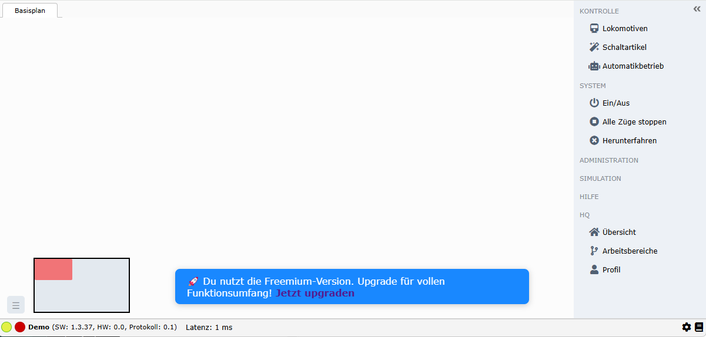

## Editiermodus

Wir klicken auf "Administration", das Submenü öffnet sich. Mit einem zweiten Klick auf "Layout" wird der Editiermodus gestartet.

Der Werkzeugkasten (engl. *Toolbox*) öffnet sich und das Raster für die Gleisplanfläche zum Ausrichten der Gleisstücke wird angezeigt.

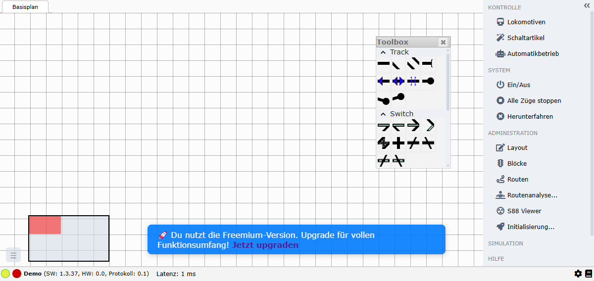

## Gleisstücke setzen

Mit der Maus kannst du jetzt aus der Toolbox mit gedrückter linken Maustaste die einzelnen Gleisstücke aus der Toolbox selektieren und in den Gleisplan fallen lassen, sog. Drag-and-Drop.

:::note

Es ist nicht erforderlich jedes einzelnen Gleisstück aus der Toolbox immer wieder zu selektieren. Das letzte Gleisstück das gesetzt wurde, wird bei weiteren Kausklicks in leere Bereiche im Gleisplan gesetzt. Dies beschleunigt das Setzen von Gleisstücken erheblich.

:::

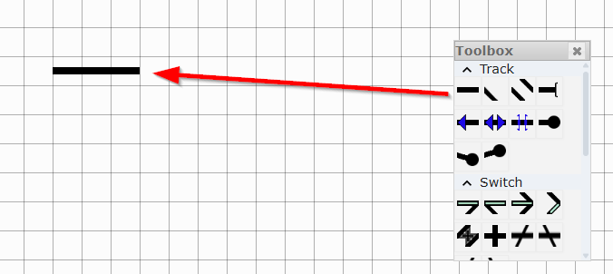

Wenn du ein gesetztes Gleisstück nochmal anklickst, so erhälst du ein Editiermenü mit dem du das gleisstück drehen oder auch löschen kannst.

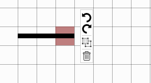

## Ausgangslage

Versuch bitte den Plan im nachfolgenden Screenshot nachzustellen. Dieser Plan wird die Grundlage für die nachfolgenden Schritte.

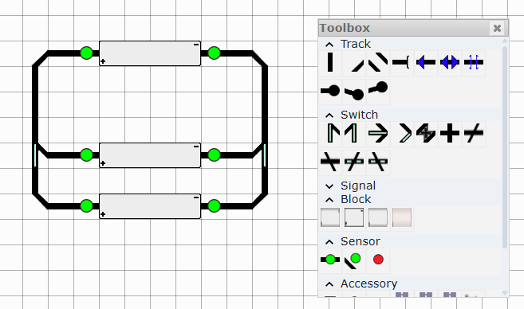

Nach dem nochmaligen Klick auf *Layout* beendet sich der Editiermodus und wir erhalten zahlreiche Warnhinweise innerhalb des Gleisplan.

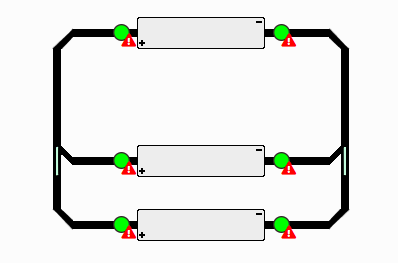

In diesem konkreten Fall deuten die Warnungen darauf hin, dass die Sensoren keine Einstellungen erhalten habe und entsprechend noch angepasst werden müssen.

## Sensoren / Feedbacks einstellen

Über das Kontextmenü auf einem der Sensoren gelangst du in die *Einstellungen* diesen einen Sensor.

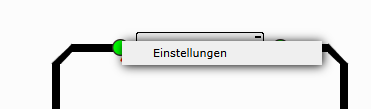

Wir wählen in dem Einstellungsdialog "s88" aus und geben bei der Adresse "1" ein. Dies machen wir für alle Sensoren, allerdings erhöhen wir die Adresse in jedem Schritt. Am Ende solltest du den Sensoren die Adressen `1` bis `6` gegeben haben.

:::note

Falls ihr an dieser Stelle sowieso plant den Simulationsmodus zu verwenden, so ist es grundsätzlich nicht von Bedeutun welchen Treiber ihr wählt. Sollte der Treiber während der Laufzeit nicht gefunden werden, so wird automatisch ein **S88-Simulator** verwendet. Dadurch ist die Nutzung des simulierten Automatikbetriebs gewährleistet.

:::

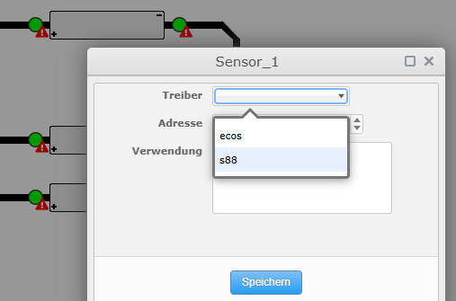

Die Warnidikatoren sollten verschwunden sein.

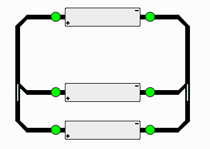

## Schaltartikel einstellen

Die Schaltartikel musst du über "Schaltartikel" in der rechte Menuleiste einstellen. Klicke dafür auf "Schaltartikel", es öffnet sich ein entsprechende Dialog.

Der Dialog sollte in etwa sei aussehen:

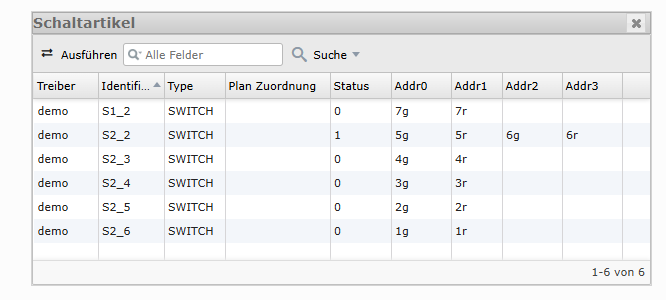

In diesem Dialog geht es darum, dass die einzelnen hardwareseitig bekannten Schaltartikel auf ein Gleisstück im Gleisplan gemappt werden. 

`railhq.io` weiß nicht wie deine Hardware auf deiner Anlage verbaut ist, diese Information muss mitgeteilt werden. 

In der Spalte "Plan Zuordnung" wählst du daher den Schaltartikel aus, der passend zu deiner Anlage hier entsprechend im Plan korrekt ist.

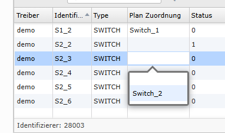

Die passende Benennung findest du entweder heraus indem du mit der Maus über das Gleisstück fährst, der Name wird dann unten rechts angezeigt, ...

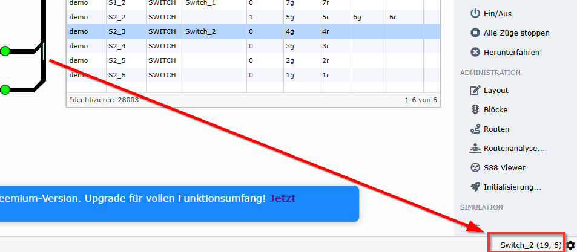

...oder du schaltest die Labels der Gleisstücke an.

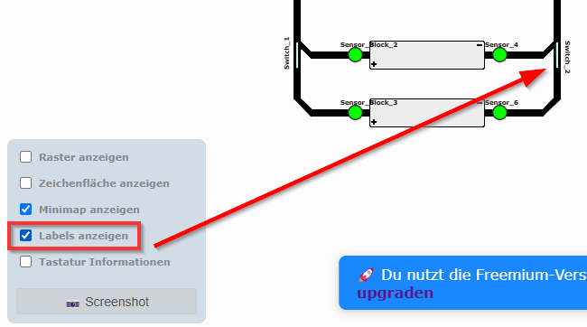

## Blöcke

Fast schon fertig, aber auch nur fast, den Blöcken müssen die passenden Sensoren / Feedbacks zugewiesen werden. Dafür öffnen wir "Blöcke" über den Menüpunkt "Administration / Blöcke" in der rechten Navigationsleiste.

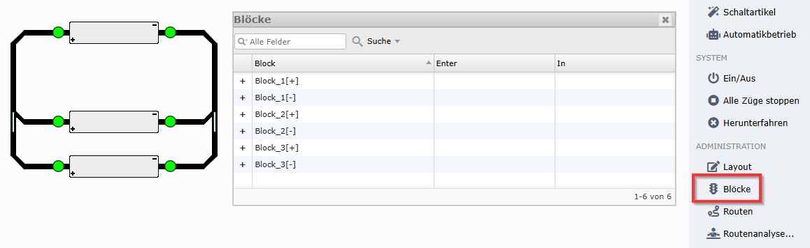

Wie bei den Schaltartikeln hilft es uns wenn wir mit der Maus über die Blöcke fahren um deren Namen zu ermittelnt, aber auch die aktivierten Labels können helfen.

Bei den Blöcken muss jede Seite konfiguriert werden, also einmal **[+]**, wie auch **[-]**; hier kommt es auf die sichtweise an, ob es sich dabei um *Enter* oder *In* handelt.

:::note

Wenn du eine Zeile in dem Blöcke-Dialog anwählst, so wird die entsprechende Zuordnung im Gleisplan visuell hervorgehoben.

:::

In diesem Beispiel halten wir uns an die Best Practise und ordnen alle Blöcke so an, dass links immer die **[+]**-Seite ist, wir fahren beim Block mit dem Namen "Block_1[+]" also von links nach rechts in den Block, entsprechend ist links "Enter" und rechts "In". Andersherum wären die Eintragung dann gegenteilig hinzuzufügen.

Ein Screenshot bringt es eher auf den Punkt:

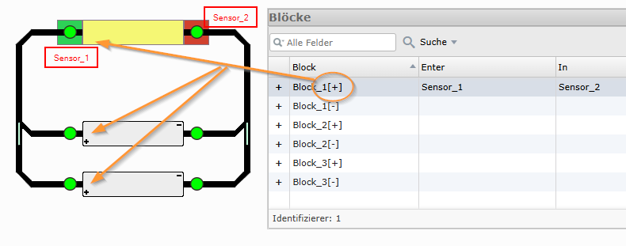

Die vollstände Konfiguration sollte in etwa wie folgt aussehen:

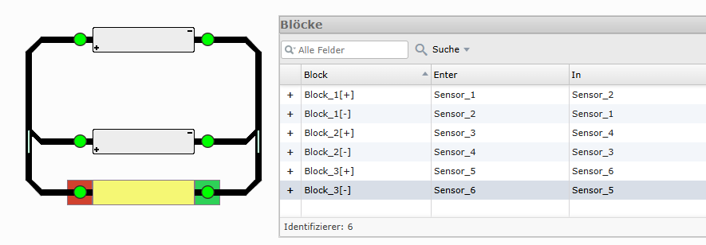

## Routenplanung

Bisher haben wir folgendes gemacht:

- einen Gleisplan mit drei Blöcken und zwei Weichen erstellt
- die Adressierung der Sensoren/Feedbacks
- die Zuweisung der Sensoren/Feedbacks zu den dazugehörigen Blöcken
- das Mapping der Hardwareinformationen der Schaltartikel zu den Gleisplandarstellungen

:::note

Die Adressierung der Schaltartikel geschieht direkt über deine angeschlossene Steuerungszentrale. Eine direkte Adressierung der Schaltartikel ist noch nicht vorgesehen.

:::

Im nächsten Schritt werden wir die möglichen Routen ermitteln und prüfen.

Klick bitte auf "Administration / Routenanalyse...":

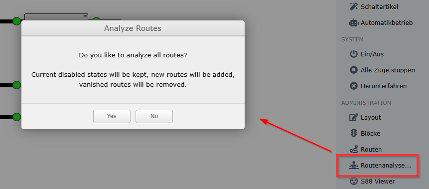

Bestätige die Nachfrage mit "Ja" und öffne danach das Protokollbuch:

Die Ausgabe sollte in etwas wie folgt aussehen, in unserem Fall wurden 8 mögliche Routen gefunden.

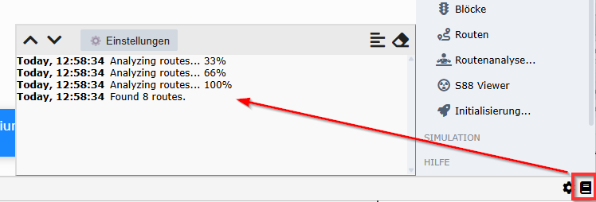

Klick auf "Administration / Routen" und die Routen sollten aufgelistet werden.

Wähle eine Zeile und die entsprechende Route wird im Gleisplan hervorgehoben.

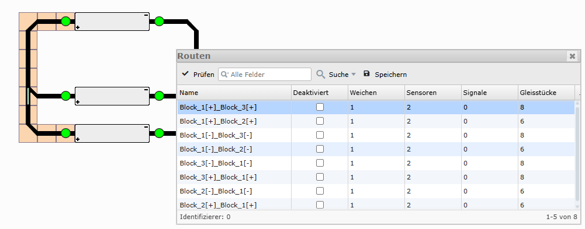

## Simulationsbetrieb

Wir sind soweit und können den Gleisplan in Betrieb nehmen.

Öffne den Lokomotiven-Dialog, wähle eine Lokomotive und ziehe diese in einen Block hinein (sog. *Drag and Drop*).

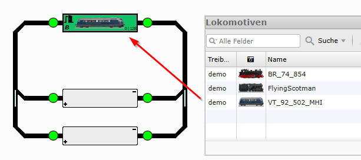

Aktiviere den Simulationsmodus:

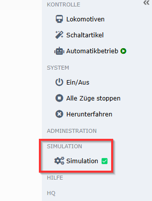

Klick auf "Automatikbetrieb" und bestätige die Auswahl entsprechend:

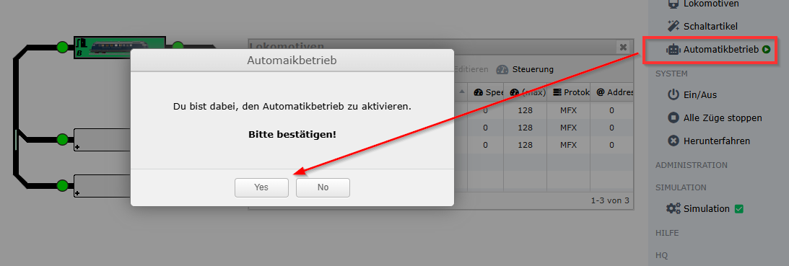

Die Automatik ist aktiv, es werden Routen gesucht und die Geschwindigkeiten der Lokomotive gesetzt.

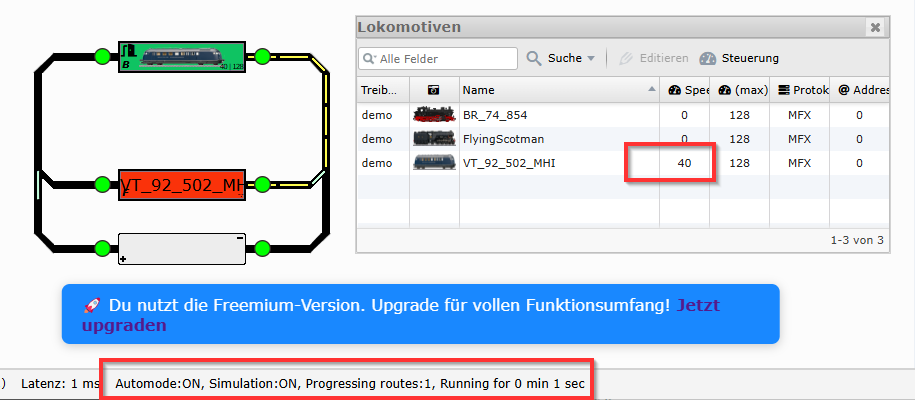

Wähle erst den Sensor zur Einfahrt des Blocks an und danach den Sensor für die Zielerreichung.

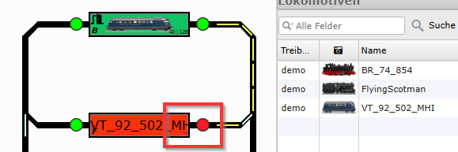

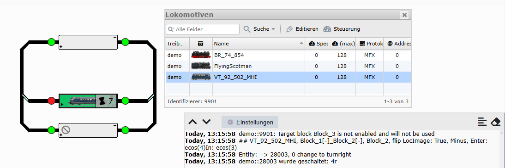

Beim Klick auf den zweiten Sensor hat die Lokomotive ihr Ziel erreicht. Es wird eine Stoppuhr gestartet und nach Ablauf dieser Zeitspanne wird eine neue Route gesucht und befahren.

## Automatik beenden

Mit einem Weiteren Klick auf "Automatikbetrieb" kann eben dieser wieder beendet werden.

Sollten sich dann noch Lokomotiven in Bewegung befindet, so wird automatisch auf deren Beendung der Fahrt gewartet werden. 

Sollte es einmal erforderlich sein, eben diesen Wartemechanismus vorzeitig zu beenden, so kann dies über die aufkommende "Stop"-Taste unten in der Statusleiste ausgeführt werden.

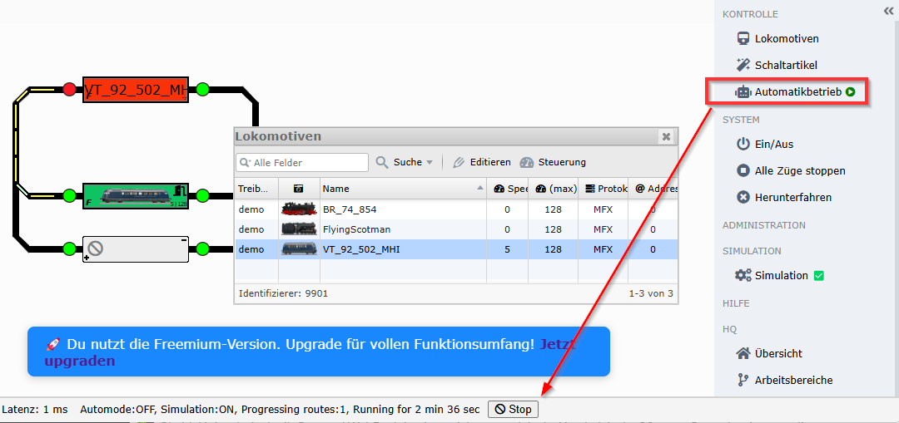
