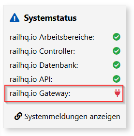
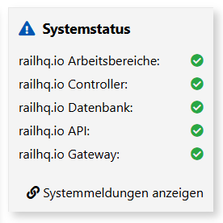
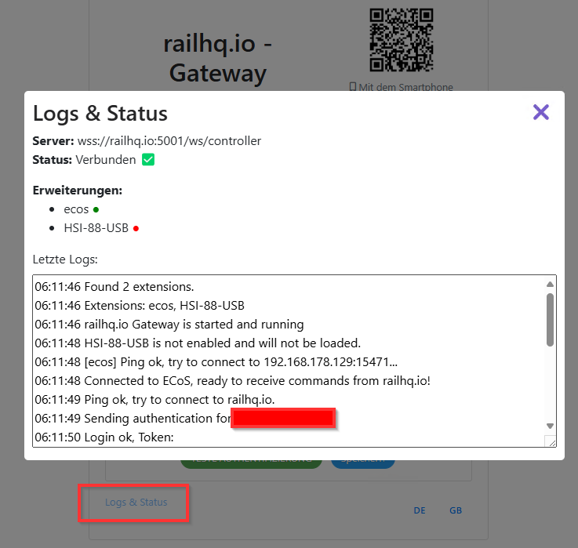

# `railhq.io - Gateway` mit `railhq.io` verbinden

## Systemstatus in der Übersicht (Dasboard)

Wenn alle Einstellungen korrekt vorgenommen wurden – wobei im Wesentlichen nur der Benutzername und das Passwort deines Benutzerkontos angepasst werden müssen – übernimmt das Gateway den Rest der Arbeit automatisch.

Sobald das Gateway gestartet wurde, versucht es fortlaufend, die Verbindung zu `railhq.io` aufrechtzuerhalten.

Den Verbindungsstatus kannst du jederzeit auf der Übersichtsseite (Dashboard) einsehen.

Wenn keine Verbindung besteht, dann ist das entsprechende Icon rot:

Sobald eine Verbindung besteht, wechselt das Icon von rot auf grün:

Auch die anderen Indikatoren zeigen immer den aktuellen Status von der jeweiligen `railhq.io`-Systemkomponente.

## Logs & Status über das Gateway

Für weitere Protokollierungen findest du auf der Konfgurationsseite des Gateway weitere Wege und Ausgaben. Klicke dafür auf "Logs & Status" um die letzten Systemmeldungen des Gateways anzuzeigen. Zudem kannst du den aktuellen Verbindungsstatus zu `railhq.io`-Server sehen, aber auch welche Hardware aktuell aktiv eingebunden ist, dargestellt durch die kleineren runden roten/grünen Punkte in der Auflistung der Erweiterungen.

