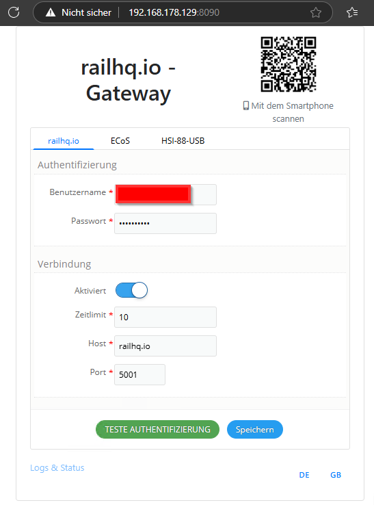
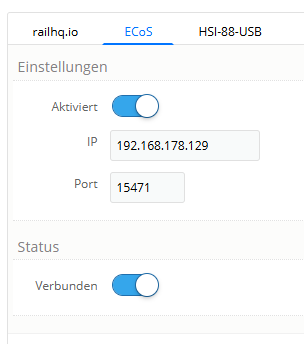
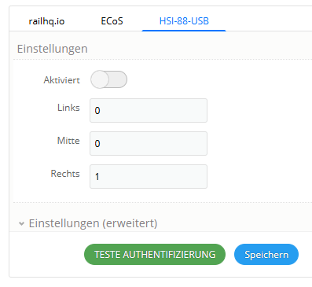
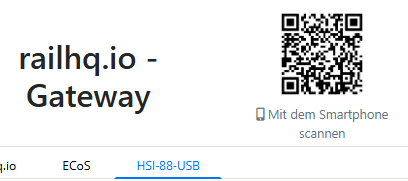

# Gateway - Konfiguration

Die Konfiguration des Gateway wird über eine Weboberfläche ausgeführt, klick dafür auf "Konfiguration", ein Browser sollte sich öffnen.

An den Verbindungsdaten gibt es ersteinmal nichts anzupassen. Bei der Authentifizierun musst du deine Anmeldedaten deines Benutzerkontos bei `railhq.io` eingeben. Diese Daten kannst du mit einem Klick auf "TESTE AUTHENTIFIZIERUNG" entsprechend prüfen, es folgt eine entsprechende Meldung.

## Gateway - Konfiguration - ECoS

Auf der Reiter "ECoS" müssen in der Regel nur die Verbindungsdaten zu deiner ESU ECoS eingetragen werden, meist nur eine passende IP-Adresse/passender Hostname, da der Port eigentlich fest vorgegeben ist.

Speicher deine Änderungen.

## Gateway - Konfiguration - HSI-88-USB

Wer das *HSI-88-USB* angeschaff hat und auch entsprechend nutzt, der weiß eigentlich am besten was hier einzustellen ist. Daher verweisen wir an dieser Stelle auf die offizielle Dokumentation des Herstellers.

Auf dem Screenshot sind jedenfalls folgende Werte beispielhaft eingestellt:

- die Verbindung zum USB-Anschluss ist nicht aktiviert

- an den entsprechenden Anschlussports des HSI-88-USB befindet sich einzig an Port "Rechts" ein S88-Rückmeldemodul

## Gateway - QR-Code

Über den QR-Code kann die Konfiguration direkt von einem Smartphone aus geöffnet werden. Das Smartphone oder Tablet muss sich natürlich im gleichen Netzwerk befinden.

Das ist sehr praktisch, wenn man sich gerade irgendwo unterhalb der Anlage befindet und entsprechende Einstellungen machen will.
