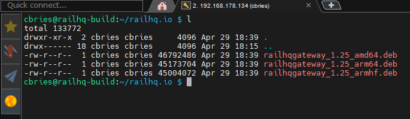
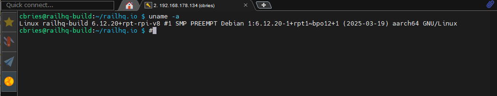
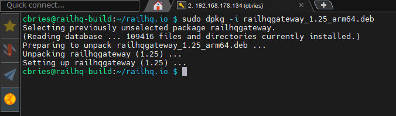
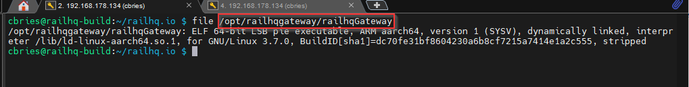
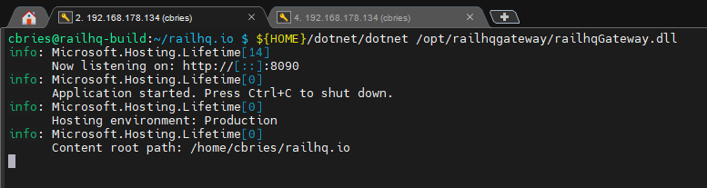
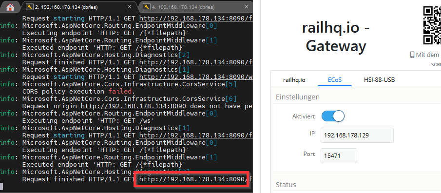

# Installationsumfang bei Linux / RaspberryPi

Für Linux steht ein `x64` deb-Paket bereit, welches i.d.R. von den gängigsten Debian-Derivaten unterstützt wird. Die RaspberryPi-Varianten werden für `x86` (also 32-Bit-Architektur) und `x64` (also 64-Bit-Architektur), jeweils mit `arm`-Support, bereitgestellt.

## Voraussetzungen: .NET Runtime 8

Damit die lokale Steuerung auf einem Linux-System oder Raspberry Pi korrekt funktioniert, muss die **.NET Runtime in Version 8** installiert sein. Diese Runtime ist notwendig, um die Anwendung auszuführen, da sie auf der .NET-Plattform basiert.

> **Hinweis:** .NET 8 ist plattformübergreifend und wird direkt von Microsoft unterstützt. Auf dem Raspberry Pi ist die Installation in wenigen Schritten möglich.

### Manuelle Installation von .NET SDK 8 unter Linux (ARM64 / Raspberry Pi)

Falls die .NET Runtime oder das SDK nicht über die Paketverwaltung verfügbar ist oder du eine bestimmte Version benötigst (z. B. auf einem Raspberry Pi), kannst du die .NET SDK manuell installieren.

### Voraussetzungen

Installiere zunächst die benötigten Systempakete:

```bash
sudo apt update
sudo apt-get install curl wget vim
sudo apt install -y libunwind8 libssl-dev
mkdir tmp
cd tmp
wget https://dotnetcli.azureedge.net/dotnet/Sdk/8.0.204/dotnet-sdk-8.0.204-linux-arm64.tar.gz
mkdir -p $HOME/dotnet
tar zxf dotnet-sdk-8.0.204-linux-arm64.tar.gz -C $HOME/dotnet
echo 'export DOTNET_ROOT=$HOME/dotnet' >> ~/.bashrc
echo 'export PATH=$PATH:$HOME/dotnet' >> ~/.bashrc
source ~/.bashrc
```

Das Ergebnis kann dann so aussehen:

```bash
cbries@railhq-build:/home/cbries/railhq.io# dotnet --version
8.0.204
```

## Installation vom `railhq.io - Gateway`

Die Schritte für Linux oder RaspberryPi unterscheiden sich kaum und können jeweils übernommen werden, die Namen der zu installierenden Dateien müssen entsprechend nach eurem Bedarf angepasst werden.

Ladet Euch die erforderlichen Dateien auf euer System. Erstellt euch ruhig einen entsprechenden Unterordner. In dem nachfolgenden Screenshot seht ihr eine Möglichkeit wie das ausseen kann. Alle zur Verfügung stehenden `deb`-Pakete wurden in den Unterordner `${HOME}/railhq.io/` geladen:



Prüft mit `uname -a` welche Systemarchitektur ihr habt. Hier für ein RaspberryPi mit `64Bit` sieht das Ergebnis so aus:



Wir erkennen, dass es sich um ein `64-Bit ARM-System` mit Linux handelt. Die entscheidene Stelle: `aarch64 GNU/Linux`

**Erklärung:**

- aarch64 steht für ARM Architecture 64-bit.
- Das ist die Architekturbezeichnung für ARMv8-A im 64-Bit-Modus.
- Diese wird typischerweise von modernen Raspberry Pi Modellen (wie Pi 3, 4, 5) im 64-Bit-Betriebssystem verwendet.

Wir müssen in diesem Fall also das `deb`-Paket **railhqgateway_1.25_arm64.deb** installieren:

```bash
sudo dpkg -i railhqgateway_1.25_arm64.deb
```



Das Gateway wird in `/opt/railhqgateway` installiert:



### Startkonfiguration

Wie bei der Windows-Variante wird die Konfiguration über die Datei `railhqGateway.json` vorgenommen, wobei man dies auch bequem über die Konfigurationswebseite machen kann. Mir sind aber die Gewohnheiten der meisten Linux-Nutzer bewusst, daher könnt ihr die Einstellungen auch selber durchführen.

Die Datei `railhqGateway.json` wird in dieser Reihenfolge gesucht und entsprechend geladen:

1) `${HOME}/railhqGatewy.json`
2) `/opt/railhqgateway/railhqGateway.json`

Eine Basisversion wird im Pfad **(2)** zur Verfügung gestellt, kopiert diese am besten in **(1)**:

`copy /opt/railhqgateway/railhqGateway.json ${HOME}/railhqGatewy.json`

### Start

Starten könnt ihr das Gateway dann direkt in einer Shell:

```bash
${HOME}/dotnet/dotnet /opt/railhqgateway/railhqGateway.dll
```



Nun kann man direkt mit einem Browser aus dem eigenen Netzwerk auf das Gateway zugreifen. Die passende Adresse aus diesem Beispiel ist: `http://192.168.178.134:8090/`.


