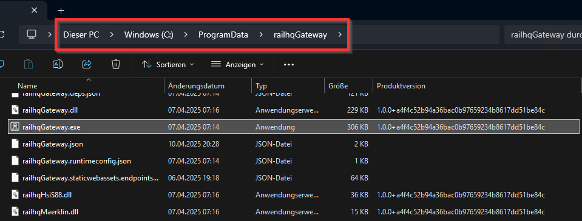
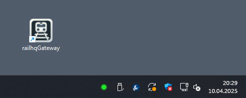
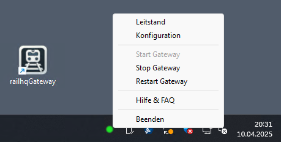

# Installationsumfang bei Windows

`railhq.io - Gateway` installiert sich im `ProgramData`-Ordner. Hierbei hat das Gateway vollen Lese- und Schreibzugriff. Für etwaige Protokolldateien oder Analysen ist es ausreichend innerhalb dieses Ordners zu schauen.

## Desktop

Nach der Installation findest du bei Windows ein neues Icon auf dem Desktop. Mit einem Doppelklick kannst du das Gateway starten. Eine gestartete Gateway-Instanz erkennst du an der grünen runden Leuchte im Systray.

Das Systray bietet ein Kontextmenü um damit schnell auf das `railhq.io`-Dashboard (hier "Leitstand") zu gelangen.

