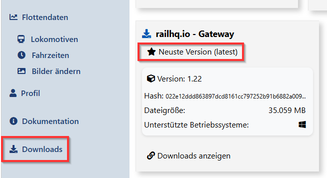

# Was ist das `railhq.io - Gateway`?

Das `railhq.io - Gateway` ist die lokale Brücke zwischen deiner Modellbahnanlage und der cloudbasierten Steuerungsplattform von `railhq.io`. Es läuft auf deinem PC oder einem lokalen Server und verbindet deine Hardware sicher und zuverlässig mit der Cloud – in Echtzeit.

Ob `ESU ECoS` oder `LDT HSI-88-USB`: Das Gateway bindet deine angeschlossenen Geräte an, übernimmt die Kommunikation und überträgt Sensordaten, Schaltbefehle und Loksteuerung direkt an den smarten Controller `railhq.io`.

Dank verschlüsselter Verbindung und minimalem Setup kannst du deine Anlage von überall aus steuern.

## Features im Überblick

- Setup gestützte Installation auf Windows-Systemen

- lokale Hardwareanbindung (z. B. ECoS, HSI-88)

- sicherer, verschlüsselter Cloud-Zugang

- vollständig integrierbar in dein `railhq.io`-Konto

- Mögichkeit der Systemdiagnose

## Setup & Installation

Das Setup des `railhq.io - Gateway` liegt nach der Registrierung und Anmeldung deines Benutzers auf der Überblickseite (also dem *Dashboard*) in der aktuellen Version zum Download bereit. Das Gateway wird kontinuierlich verbessert und an aktuelle Technologien angepasst. Der rot umrandete Link auf dem nachfolgenden Screenshot lädt immer die neuste Version für Windows. Andere Varianten für Linux oder ein RaspberryPi müssen gesondert ausgewählt werden.

Jeder der schon einmal ein Setup in der Hand hatte und ausgeführt hat, wird das Gateway problemlos installieren können.
