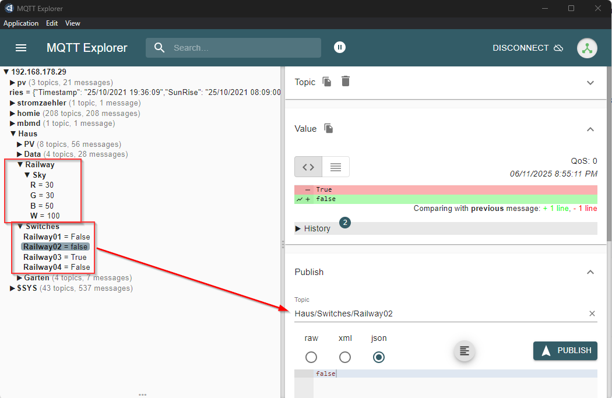

# MQTT-Broker: Installation bei Linux / RaspberryPi

Damit `railhq.io` sicher über das Internet oder ein lokales HTTPS-Netzwerk mit einem MQTT-Broker kommunizieren kann, muss der Broker über SSL/TLS abgesichert und über WebSockets auf Port `9001` erreichbar sein.

## 1. Mosquitto installieren

```bash
sudo apt update
sudo apt install -y mosquitto mosquitto-clients
```

## 2. SSL-Zertifikate erstellen

Falls du keine Zertifikate von einer offiziellen CA hast, kannst du dir selbstsignierte Zertifikate erstellen:

```bash
sudo mkdir -p /etc/mosquitto/certs
cd /etc/mosquitto/certs

# Erstelle privates Schlüssel-Zertifikat
openssl genrsa -out mqtt.key 2048

# Erstelle Zertifikat
openssl req -new -x509 -days 365 -key mqtt.key -out mqtt.crt \
  -subj "/CN=mqtt.local"
```

:::note

Für produktive Nutzung sollte ein echtes Zertifikat (z. B. von Let's Encrypt) verwendet werden.

:::

## 3. Mosquitto-Konfiguration für WebSockets + SSL/TLS

Bearbeite oder erstelle die Datei `/etc/mosquitto/conf.d/websockets.conf`:

```bash
listener 9001
protocol websockets

certfile /etc/mosquitto/certs/mqtt.crt
keyfile /etc/mosquitto/certs/mqtt.key

allow_anonymous true
```

:::note

Alternativ kannst du auch Authentifizierung aktivieren und `allow_anonymous false` setzen.

:::

## 4. Mosquitto neustarten

```bash
sudo systemctl restart mosquitto
```

## 5. Verbindung zu `railhq.io`

In deinem Skript kannst du nun so den MQTT-Broker per WebSocket + TLS verbinden:

```javascript
const brokerUrl = "wss://192.168.178.29:9001";

try {
    await hqMqttClient.connect(brokerUrl);
    log('MQTT verbunden:', brokerUrl);
} catch (err) {
    error('MQTT-Verbindung fehlgeschlagen:', err);
    return;
}

hqMqttClient.publish("Haus/Switches/Railway01", "true");

await hqUtils.sleep(1000);

await hqMqttClient.disconnect();
hqMqttClient.cleanupAll();
```

EIne Kurzversion für einmaliges Absenden von entsprechenden Daten sieht wie folgt aus:

```javascript
hqMqttClient.publishOnce("wss://192.168.178.29:9001", "Haus/Switches/Railway01", "true")
```

## 6. Hinweis zu „Mixed Content“

Da `railhq.io` über HTTPS geladen wird, darf es keine unverschlüsselten (HTTP-) Verbindungen zu externen Diensten oder Bildern geben. Sonst blockiert der Browser die Kommunikation mit dem Fehler:

:::note

"Mixed Content: The page was loaded over HTTPS, but requested an insecure WebSocket (ws://...)"

:::

Deshalb ist die Verwendung von `wss://` (WebSocket Secure) zwingend erforderlich. Nur so kann dein Browser die Verbindung akzeptieren.

## 7. Dateiberechtigungen korrekt setzen

Damit Mosquitto die SSL-Zertifikate lesen kann, müssen die Zugriffsrechte korrekt gesetzt sein. Andernfalls startet der Dienst nicht oder meldet fehlende Leserechte.

Führe folgendes aus, um die richtigen Berechtigungen zu setzen:

```bash
# Eigentümer auf Mosquitto setzen
sudo chown mosquitto:mosquitto /etc/mosquitto/certs/mqtt.*

# Nur lesbar für den Besitzer
sudo chmod 600 /etc/mosquitto/certs/mqtt.key
sudo chmod 644 /etc/mosquitto/certs/mqtt.crt
```

:::note

🔒 Der private Schlüssel (mqtt.key) darf nicht öffentlich lesbar sein – sonst verweigert Mosquitto aus Sicherheitsgründen den Start.

:::

Anschließend Mosquitto neu starten:

```bash
sudo systemctl restart mosquitto
```

Damit ist die TLS-basierte MQTT-Konfiguration komplett und Mosquitto startet zuverlässig und sicher mit verschlüsselter WebSocket-Unterstützung auf Port `9001`.

## Zusammenfassung

- MQTT ist ein optionales Feature in `railhq.io`, aber sehr nützlich zur Vernetzung mit **Home-Automation-Systemen** wie **Lichtsteuerung**, **Dämmerungssimulation**, **Sprachsteuerung**, etc.

- Ein eigener MQTT-Broker (z. B. Mosquitto) wird lokal im Netzwerk benötigt.

- Für die Nutzung über HTTPS/WebUI ist eine Verbindung via `wss://` über Port `9001` erforderlich.

- Mit etwas Konfiguration lässt sich Mosquitto schnell in einem sicheren Modus betreiben.

### Windows und MQTT Explorer

Für das Testen des MQTT-Broker kann `MQTT Explorer` als besonders empfehlenswert erwähnt werden.


