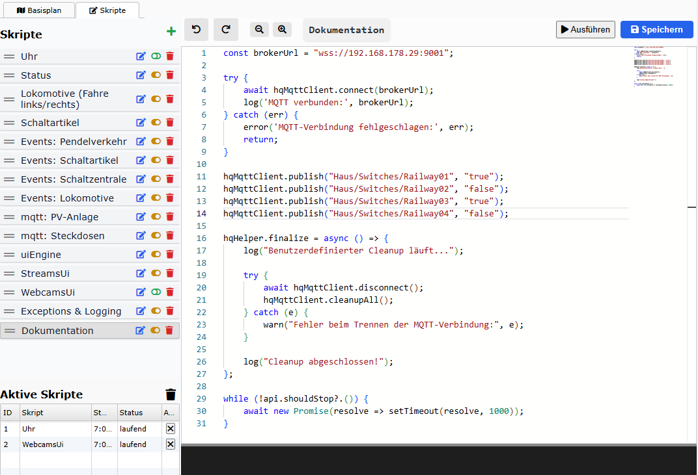

# Einleitung & Verwendung

## Was ist `MQTT`?

MQTT *(Message Queuing Telemetry Transport)* ist ein leichtgewichtiges Messaging-Protokoll, das speziell für die Kommunikation zwischen Geräten mit geringer Bandbreite oder instabiler Verbindung entwickelt wurde. Es basiert auf dem Publisher/Subscriber-Prinzip und wird häufig im Bereich **Internet of Things (IoT)** und in der Automatisierung eingesetzt – also genau dort, wo es auch bei railhq.io besonders nützlich ist.

## Merkmale von `MQTT`:

- 📡 Asynchrone Kommunikation: Geräte senden („publish“) Daten an einen zentralen Server (Broker), und andere Geräte oder Anwendungen („subscribe“) empfangen diese Daten, wenn sie relevant sind.

- ⚡ Sehr effizient: Extrem geringes Overhead – ideal für schnelle Statusänderungen oder schmale Netzwerke.

- 🔁 Zuverlässig: Unterstützt mehrere QoS-Stufen (Quality of Service), um Nachrichten zuverlässig zu übertragen.

- 🔒 Sicher: Übertragungen können über TLS verschlüsselt werden; Authentifizierung per Benutzername/Passwort ist möglich.

## Warum `MQTT` bei `railhq.io`?

In `railhq.io` kann MQTT als optionale Ergänzung genutzt werden, um Zustandsänderungen in Echtzeit zu übertragen – z. B. beim Schalten von Weichen, Auslösen von Signalen oder zur Synchronisierung zwischen mehreren Steuerinstanzen. Die Nutzung von MQTT ist nicht erforderlich für die eigentliche Steuerung der Modelleisenbahn, sondern bietet zusätzliche Möglichkeiten für fortgeschrittene Anwender.

Um MQTT verwenden zu können, muss der Anwender einen eigenen MQTT-Broker im lokalen Netzwerk betreiben, z. B. Mosquitto oder vergleichbare Software. `railhq.io` fungiert dabei als MQTT-Client, der sich mit dem Broker verbindet und Nachrichten senden oder empfangen kann.

Die Integration eröffnet vielfältige Möglichkeiten:

- 💡 Lichtsteuerung mit Smart-Home-Komponenten wie Philips Hue oder Shelly,

- 🌅 Dämmerungssimulationen auf Basis externer Sensorwerte,

- 🗣️ Sprachsteuerung via Alexa, Google Home oder anderen Diensten,

- 🔔 Systemübergreifende Ereignisverarbeitung, z. B. Alarmierungen, Statusanzeigen oder Trigger für Automationen.

So lässt sich die Modelleisenbahn nahtlos in ein modernes Smart-Home-System einbetten – ohne dass MQTT für die Grundfunktionalität zwingend notwendig ist.

## Beispiel

Das nachfolgende Beispiel sendet den Wert `true` oder `false` an ein sog. MQTT-Topic (hier `Haus/Switches/Railway*`). Am Anfang wird eine Verbindung zum MQTT-Broker aufgebaut, daraufhin wird der Wert gesendet und innerhalb der `finalize`-Methode wird beim Beenden des Skript intern die MQTT-Instanz ordentlich beendet und aufgeräumt (Stichwort *Memory-Leak*).

```javascript showLineNumbers 

const brokerUrl = "wss://192.168.178.29:9001";

try {
    await hqMqttClient.connect(brokerUrl);
    log('MQTT verbunden:', brokerUrl);
} catch (err) {
    error('MQTT-Verbindung fehlgeschlagen:', err);
    return;
}

hqMqttClient.publish("Haus/Switches/Railway01", "true");
hqMqttClient.publish("Haus/Switches/Railway02", "false");
hqMqttClient.publish("Haus/Switches/Railway03", "true");
hqMqttClient.publish("Haus/Switches/Railway04", "false");

hqHelper.finalize = async () => {
    log("Benutzerdefinierter Cleanup läuft...");

    try {
        await hqMqttClient.disconnect();
        hqMqttClient.cleanupAll();
    } catch (e) {
        warn("Fehler beim Trennen der MQTT-Verbindung:", e);
    }

    log("Cleanup abgeschlossen!");
};

while (!api.shouldStop?.()) {
    await new Promise(resolve => setTimeout(resolve, 1000));
}
```

Dieser Code kann so in der Form in ein Skript kopiert und zur Ausführung gebracht werden, entsprechende Anpassungen der `brokerUrl` und MQTT-Topics vorausgesetzt.


