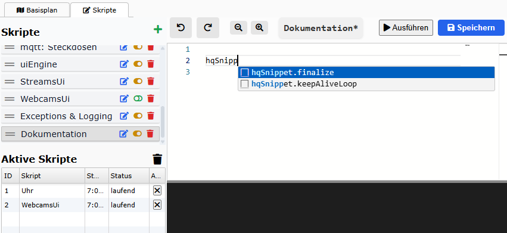
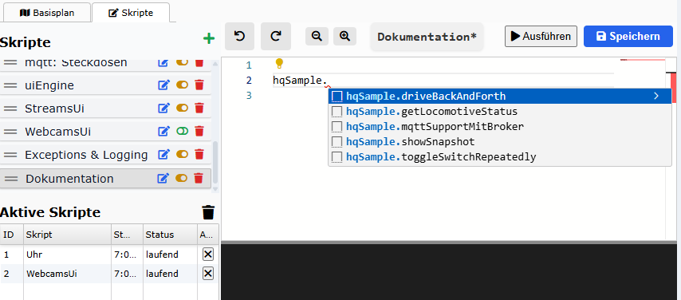

# 🧩 Codebeispiele und Snippets

Um den Einstieg in das Skripting auf railhq.io so einfach wie möglich zu gestalten, stellen wir eine Vielzahl von Beispielen und Code-Snippets direkt im Editor zur Verfügung.

## ✨ Intelligente Snippets per IntelliSense

Der integrierte Monaco-Editor erkennt bestimmte Kürzel und schlägt automatisch passende Code-Snippets vor. So lassen sich wiederkehrende Strukturen mit wenigen Tastenanschlägen einfügen:

Diese Snippets enthalten alle notwendigen Parameter und oft auch hilfreiche Hinweise im Kommentar – so wird selbst das Schreiben komplexerer Abläufe einfach.

### 🧠 Warum Snippets?

- Reduzieren die Notwendigkeit, Funktionen auswendig zu kennen

- Fördern bewährte Strukturen und Best Practices

- Senken die Einstiegshürde für neue Nutzer:innen deutlich

## 🚀 Schneller Start mit Beispielen

Über die IntelliSense-Autovervollständigung lassen sich vorgefertigte Skriptfragmente einfügen – zum Beispiel:

- Steuerung von Weichen, Signalen oder Fahrstraßen

- Zustandsabfragen von Sensoren

- Zeitgesteuerte Abläufe

- ...und mehr!

Für das Auswählen eine Beispiel muss nur `hqSamples.` eingegeben werden:

Die Beispiele sind direkt einsatzfähig und kommentiert, damit der Ablauf leicht nachvollzogen werden kann.

