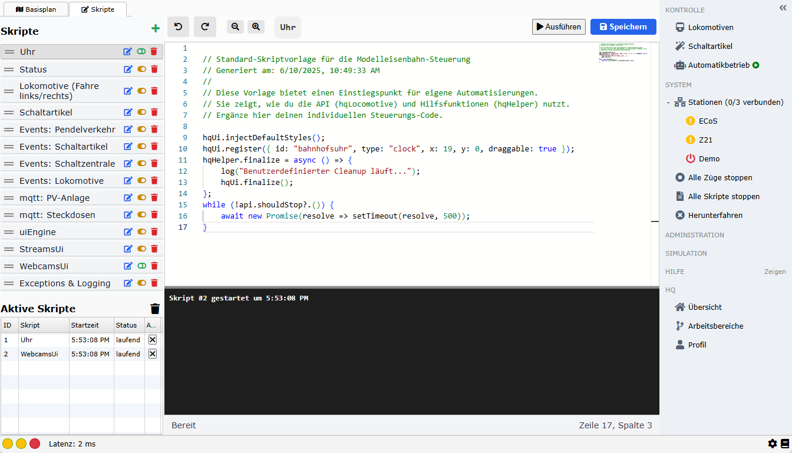
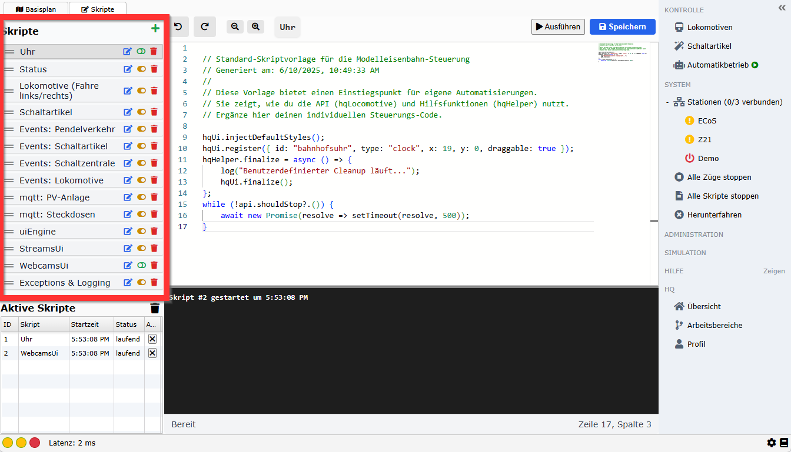
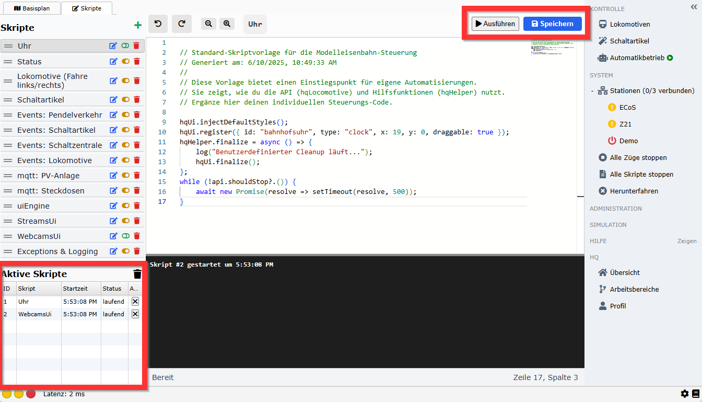
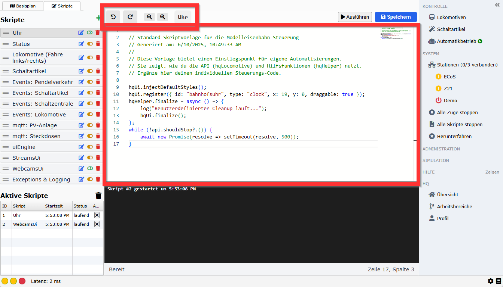
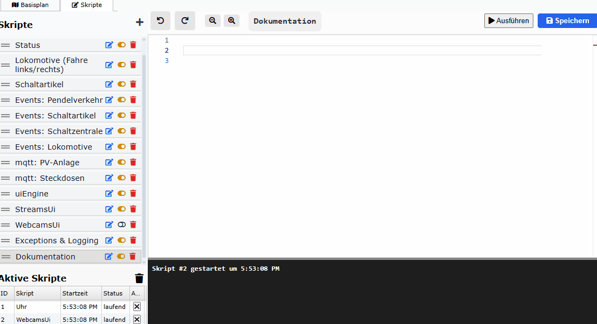
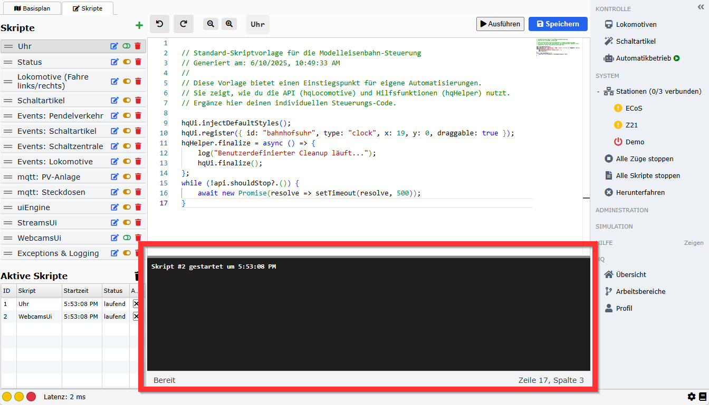
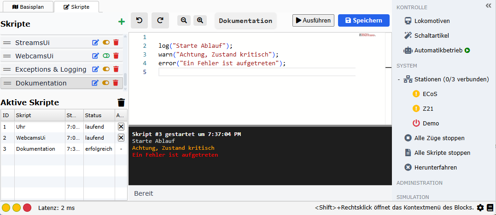
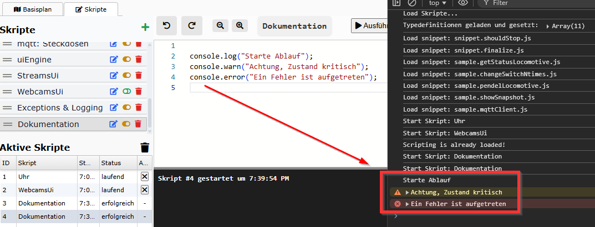

# 📋 Editorbereiche

In diesem Abschnitt werden die einzelnen Bereiche des Skripteditor beschrieben. 



## Bereiche

Grundsätzlich wird der Skripteditor in vier Bereiche unterteilt:

### Skriptliste



#### ✏️ Funktionen der Liste

| Element                     | Beschreibung                                                                                               |
| --------------------------- | ---------------------------------------------------------------------------------------------------------- |
| ☰ **Anfasser links**        | Mit gedrückter Maustaste kannst du Skripte per Drag & Drop neu anordnen. Die Reihenfolge wird gespeichert. |
| 📝 **Skriptname**           | Der aktuelle Name des Skripts.                                                                             |
| 🔧 **Schaltflächen rechts** | Drei kleine Icons zum Verwalten des Skripts:                                                               |

#### 🧰 Symbolfunktionen im Detail

| Symbol                | Funktion                                                                                                                                     |
| --------------------- | -------------------------------------------------------------------------------------------------------------------------------------------- |
| ✏️ (Stift)            | **Umbenennen**: Öffnet ein Dialogfeld zur Eingabe eines neuen Skriptnamens.                                                                  |
| Toggle                | **Auto-Start bei Plan-Ladevorgang**: Aktiviert bzw. deaktiviert, ob das Skript beim Laden des Gleisplans automatisch ausgeführt werden soll. |
| 🗑️ (Papierkorb)      | **Löschen**: Entfernt das Skript dauerhaft nach einer Sicherheitsabfrage.                                                                    |

#### 🧠 Hinweis zum Auto-Start

Skripte mit aktiviertem Auto-Start werden automatisch ausgeführt, sobald der Gleisplan vollständig geladen ist (`layoutLoaded` and `ready`). Dies ist ideal für Initialisierungen oder durchgängige Hintergrundaufgaben (z. B. Watcher, Trigger, Reset-Logik).

### Ausführung und Tasks



#### 🟢 Manuelles Starten

Skripte in railhq.io werden einmalig ausgeführt, indem du auf den „Ausführen“-Button oben rechts über dem Editor klickst. Dadurch wird ein neuer Task erzeugt, der das ausgewählte Skript als eigenen Prozess startet.

#### 📋 Task-Übersicht

Alle aktuell laufenden oder bereits abgeschlossenen Tasks werden im unteren linken Bereich in einem übersichtlichen Grid dargestellt.

Das Grid enthält fünf Spalten:

| Spalte                | Beschreibung                                                                                               |
| --------------------- | ---------------------------------------------------------------------------------------------------------- |
| 🔢 **Task-ID**        | Eine interne fortlaufende ID zur Identifikation des Tasks.                                                 |
| 📄 **Skriptname**     | Der Name des Skripts, das im jeweiligen Task ausgeführt wird.                                              |
| ⏱️ **Startzeit**      | Der exakte Zeitpunkt (Datum + Uhrzeit), an dem der Task gestartet wurde.                                   |
| 📊 **Status**         | Zeigt den aktuellen Status an: • *laufend* • *erfolgreich beendet* • *mit Fehler gestoppt* |
| ⏹️ **Beenden-Button** | Ein Stop-Button, mit dem du einen laufenden Task manuell abbrechen kannst.                                 |

#### 🔄 Statusüberwachung

Der Status jedes Tasks wird in Echtzeit aktualisiert. Fehlerhafte Skripte (z. B. mit Syntaxfehlern oder Exceptions) erhalten automatisch den Status fehlerhaft. Erfolgreich abgeschlossene Tasks zeigen den Status erfolgreich.

:::note

💡 Wenn ein Task zu lange läuft oder in eine Endlosschleife geraten ist, kannst du ihn jederzeit durch den Stop-Button manuell beenden.

:::

#### 🧰 Technischer Hintergrund

Jeder Task läuft isoliert (eigener Kontext, keine Überschneidungen)

Ausgaben und Logs werden getrennt pro Task behandelt

Der Editor bleibt dabei vollständig benutzbar

### Editierbereich (Monaco-basiert)



Der Editorbereich von `railhq.io` nutzt den mächtigen Monaco Editor, der auch in Visual Studio Code zum Einsatz kommt. Damit bietet `railhq.io` eine erstklassige, browserbasierte Umgebung zur Bearbeitung und Ausführung von Skripten.

#### 🔧 Features im Überblick

| Feature                         | Beschreibung                                                                                                                    |
| ------------------------------- | ------------------------------------------------------------------------------------------------------------------------------- |
| 🎨 **Syntax-Highlighting**      | Vollständige JavaScript-Unterstützung mit farblicher Hervorhebung von Keywords, Funktionen, Strings, Variablen etc.             |
| 🧠 **IntelliSense**             | Automatische Vervollständigung mit kontextsensitiven Vorschlägen, z. B. bei Zugriff auf globale Objekte wie `hq` oder `layout`. |
| 🪛 **Fehlermarkierung**         | Fehlerhafte Syntax oder Referenzen werden direkt im Code markiert – inklusive erklärender Tooltipps.                            |
| 🗂️ **Mehrere Tabs (optional)** | Mehrere Skripte lassen sich bearbeiten, speichern und jederzeit umschalten.                                                     |
| 💾 **Speichern & Auto-Save**    | Skripte können manuell gespeichert werden; optional steht auch eine automatische Zwischenspeicherung zur Verfügung.             |
| 🔍 **Suche & Ersetzen**         | Komfortable Suchfunktion inklusive „Alle ersetzen“-Funktion.                                                                    |
| 👁️ **Minimap**                 | Übersicht über den gesamten Code in einer kompakten Minikarte am rechten Rand.                                                  |
| 💡 **Hover-Tipps**              | Mouseover-Tipps mit Zusatzinformationen zu Funktionen, Parametern und Dokumentation.                                            |

#### 🧠 Intelligente Vorschläge

Der Editor erkennt viele `railhq.io`-spezifische Objekte und bietet dafür passende IntelliSense-Vorschläge. Beispiele:

- `hqSensors.on(..)`, `hqAccessories.switch(..)`, etc.

- Automatische Vorschläge für benutzerdefinierte Skriptfunktionen und lokale Variablen

- Dokumentationstexte (JSDoc) werden direkt im Editor angezeigt

#### 🧪 Integration mit dem Task-System

Der Editor ist direkt mit dem Task-System gekoppelt:

- Oben rechts: „Ausführen“-Button, um das aktuelle Skript sofort zu starten
- Bei Ausführung wird das Skript in einem Task gestartet und erscheint in der Task-Übersicht
- Der Editor bleibt weiterhin editierbar – parallele Tasks sind möglich

#### 🗄️ Dateibasiertes Speichersystem

- Skripte werden in einer internen Datenbank gespeichert (nicht im lokalen Browsercache)

- Skripte können umbenannt oder gelöscht werden

#### 📌 Beispiel: IntelliSense für hqSensors-Objekt



Beim Schreiben dieses Codes erkennt der Editor automatisch `hqSensors.`, etc. – inklusive Autovervollständigung und Tooltip-Erklärung.

#### 🔒 Sicherheit & Sandbox

Alle Skripte werden in einer sicheren Umgebung ausgeführt:

- Kein Zugriff auf DOM oder Browser-APIs

- Kein Zugriff auf lokale Dateien

- Kommunikation erfolgt ausschließlich über definierte railhq.io-APIs

💡 **Dennoch ist eine Erweiterung problemlos möglich:**

Skripte können auf bereits eingebundene JavaScript-Bibliotheken zugreifen, z. B.:

- jQuery

- jQuery UI

- Weitere projektinterne Hilfsfunktionen oder global verfügbare Objekte

**Beispiel:**

```javascript
// jQuery verwenden
$('#myCustomPanel').fadeIn();

// jQuery UI Beispiel
$('<div>').text("Info").dialog({ title: "Mein Dialog" });
```

Diese Flexibilität erlaubt es dir, eigene Erweiterungen und Benutzerinteraktionen vollständig in JavaScript umzusetzen, ohne `railhq.io` verlassen zu müssen.

### Ausgabe und Fehleranzeige



#### 🧾 Ausgabe und Fehleranzeige

Beim Ausführen eines Skripts wird dessen Ausgabe automatisch überwacht und im unteren Bereich des Editors sichtbar gemacht.

##### 📤 log() & Co.

Skripte können Ausgaben erzeugen, hierbei ist zu beachten, dass diese OHNE `console.` getätigt werden, nur diese Ausgaben landen im sichtbaren Bereich des Editors innerhalb der Ausgabe. Die jeweiligen Ausgaben werden farblich unterschieden.

```javascript
log("Starte Ablauf");
warn("Achtung, Zustand kritisch");
error("Ein Fehler ist aufgetreten");
```



##### 📤 console.log() & Co.

Skripte können Ausgaben wie gewohnt über die Standardfunktionen erzeugen, wobei diese Ausgaben in den `DevTools` (F12) des Browser angezeigt werden.

```javascript
console.log("Starte Ablauf");
console.warn("Achtung, Zustand kritisch");
console.error("Ein Fehler ist aufgetreten");
```


