# Auffahrblöcke in der Umsetzung mit `railhq.io`

## Start

Wir erstellen über die "Arbeitsbereiche"-Seite mit der Eingabe von "Tutorial_Staging" und dem Klick auf das "+" einen neuen Arbeitsbereich. Ihr dürft natürlich einen Namen nach euren Wünschen wählen, der Name selbst ist nicht weiter relevant und is für die nächste Schritte nicht zu beachten.

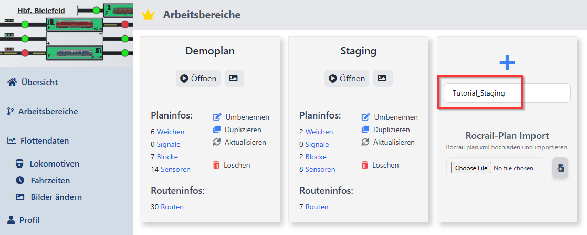

## Gleisplanerstellung

Wir werden einen sehr übersichtlichen Gleisplan mit einem Block und einem Auffahrblock erstellen. Wir können dann im Simulationsbetrieb eine Lokomotive im Kreis reisen lassen.

Hierfür klicken wir auf "Layout", der Bearabeitungsmodus öffnet sich, dies ist dann am sichtbaren Kachelmuster zu erkennen; ebenso öffnet sich die Toolbox mit der man Gleise auswählen und im Gleisplan setzen kann.

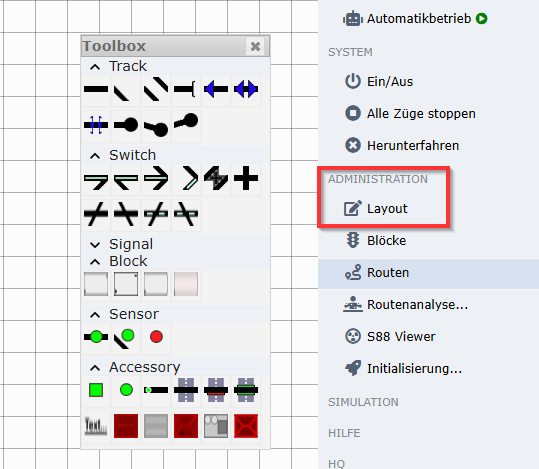

Wie eingangs erwähnt erstellen wir ein einfaches Oval mit einem Aufstellblock und einem Block. Für den einfachen Block verwenden wir zwei Sensoren um zu erkennen wann eine Lokomotive in den Block einfährt.

Für den Aufstellblock entscheiden wir uns für zwei hintereinanderliegenden Abschnitten, jeweils durch zwei Sensoren beschrieben. Die Funktionsweise ist identisch mit dem Konzept für einfache Blöcke. Ein Sensor dient für das &lt;Enter&gt;-Event, der zweite Sensor dient für das %lt;In&gt;-Event. Ein dritter Sensor kann optional als Streckenbelegung hinzugefügt werden, für dieses Tutorials ist dies allerdings nicht relevant.

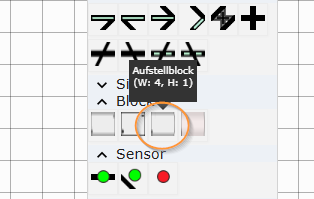

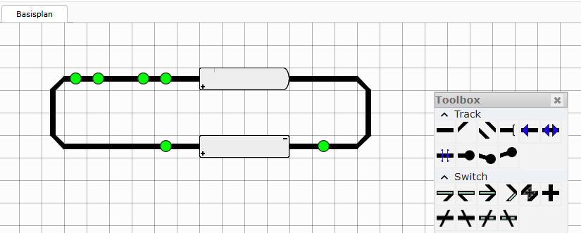

### Sensoren

Nachdem ihr die entsprechenden Gleisstücke wie auf dem Screenshot hinzugefügt habt, könnt ihr den Editiermodus mit einem Klick auf "Layout" wieder verlassen.

Nachdem ihr den Editiermodus verlassen habt, werden euch Warnungen an den einzelnen Sensoren angeeigt, hier fehlen die Adressierungen.

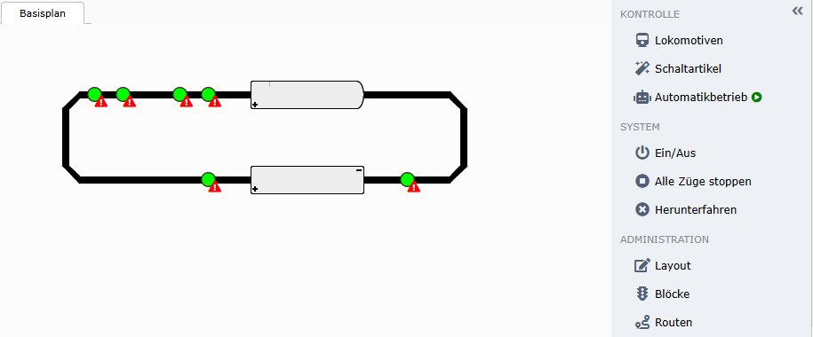

Da wir auch im Simulationsbetrieb entsprechende Sensoradressen benötigen, solltet ihr diese müber die Einstellungen einstellen. Das Einstellungsmenü erreicht ihr durch das KOntextmenü zum jeweiligen Sensor.

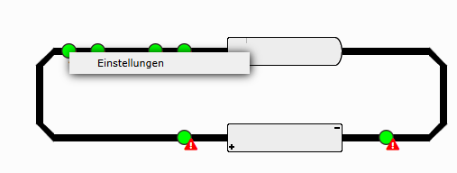

Wählt als Treiber "ecos" und setzt für jeden Sensor einen individuellen Adressenwert, hier in diesem Beispiel wählen wir die Adressen `1` bis `6`.

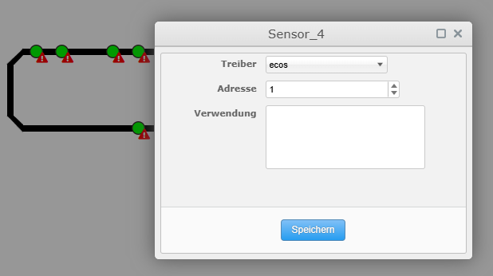

### Block

Nach der Adressierung kümmern wir uns um die passende Zuweisung der Sensoren für den einzelnen Block "Block_1", klickt dafür auf "Blöcke". In dem Dialog selektiert ihr eine Zeile, und sucht euch die passenden Sensoren für "Enter" und "In" heraus. 

:::note
Wenn ihr mit der Maus im Gleisplan über einen Sensor fahrt, so wird der Identifizierer unten rechts in der Statusleiste angezeigt.
::

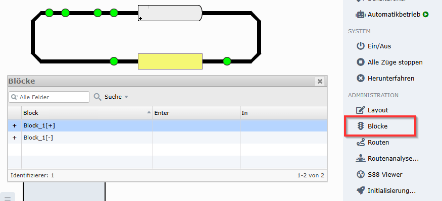

Sobald ihr den ersten Sensor ausgewählt habt, wird dieser visuell im Plan hervorgehoben. Die fertige Konfiguration sollte in etwa so wie auf diesem Screenshot aussehen.

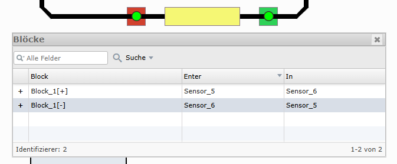

### Auffahrblock

Nun folgt der Auffahrblock. Die Einstellungen für den Aufstellbock erreicht ihr wieder über das Kontextmenü.

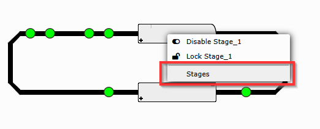

Im neuen Dialog klickt ihr zweimal auf die rot umrandete Schaltfläche (siehe Screenshot). Wie bei dem Block oben, wählt ihr in den Spalten "Enter" und "In" die passenden Sensoren aus. Hierbei ist die Reihenfolge von links/oben nach rechts/unten. Also die Sensoren ganz links im Gleisplan gehören in die erste Zeile, usw.

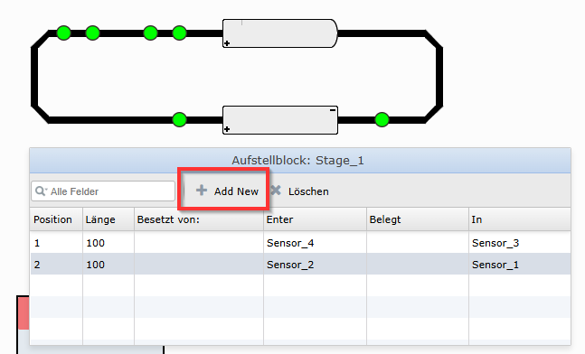

Wenn ihr die Konfiguration abgeschlossen habt, klickt irgendwo ausserhalb des Dialogs, dieser schließt sich. Im Gleisplan, bzw. im Aufstellblock werden zwei Subblöcke hinzugefügt, dies sind die neuen Abschnitte im Aufstellblock.

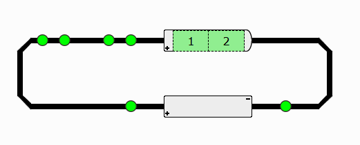

### Routen

Im nächsten Schritt lassen wir den Gleisplan analysieren und erstellen uns eine Liste an Routen. Ein Klick auf "Routenanalyse" und entsprechender Bestätigung im Dialog triggert die Analyse.

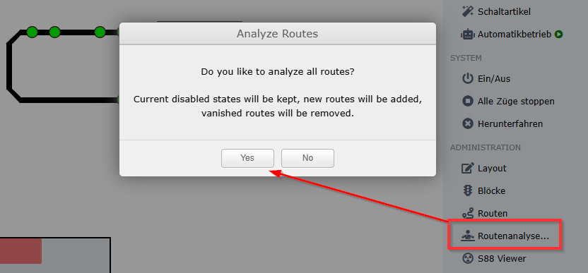

Nach der Analyse öffnet den "Routen"-Dialog, zwei Routen sollten aufgelistet sein. Wer angenommen hat es würden womöglich vier Routen gefunden werden, er hat nicht bedacht, dass der Aufstellblock nur in einer Richtung befahren werden kann.

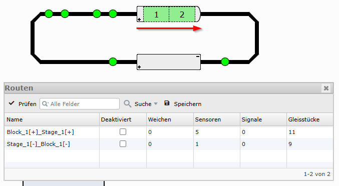

Im nächsten Schritt weisen wir dem Block eine Lokomotive zu, passen die Setzung entsprechend an, also die Ausrichtung und die Seite in der die Lokomotive eingefahren ist (beides im Kontextmenü).

Dein Plan sollte nun wie folgt aussehen:

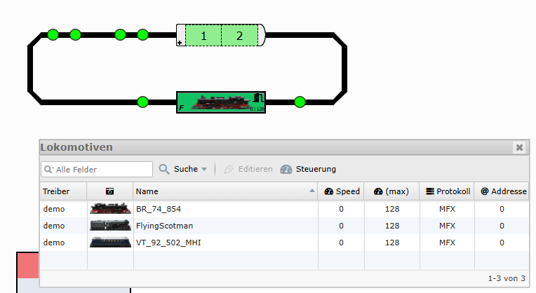

## Simulationsbetrieb

Wir sind soweit, wir können eine Lokomotive im Simulationsbetrieb durch unsere kleine neue Welt fahren lassen.

Mit einem Klick auf "Simultation" und dann auf "Automatikbetrieb" startet den simulierten automatisieren Ablauf deiner fiktiven Modelleisenbahn.

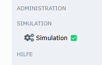

Ihr seht in den Dialogen wie die Geschwidigkeit der Lokomotive erhöht wird. Im Gleisplan selbst ist direkt das Ziel der Lokomotive zu sehen. Hierbei wird der reservierte Subblock des Auffahrblock gelb hervorgehoben.

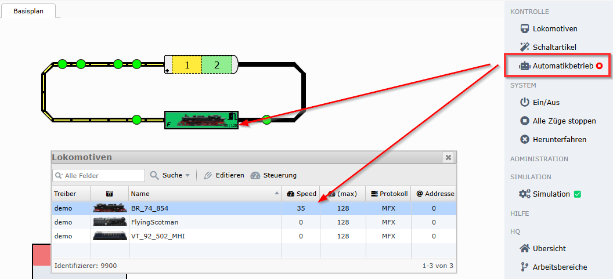

Im Simulationsbetrieb kannst du die einzelnen Sensoren mit einem Mausklick anklicken und passend in einen Zustand versetzen, der entsprechend die Routenverfolgung anpasst. Wir klicken entsprechend den passenden Sensor, daraufhin verringert sich die Geschwindigkeit der Lokomotive, da diese von der Automatik ein &lt;Enter&gt;-Event erhalten hat &mdash; die entsprechende Geschwindigkeit der Lokomotive für "Enter" kannst du in den Einstellungen der Lokomotive vornehmen.

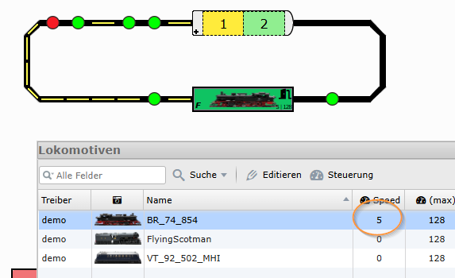

Bei einem Klick auf den nächsten Sensor wird dies als &lt;In&gt;-Event gedeutet und die Lokomotive kommt zum Halt.

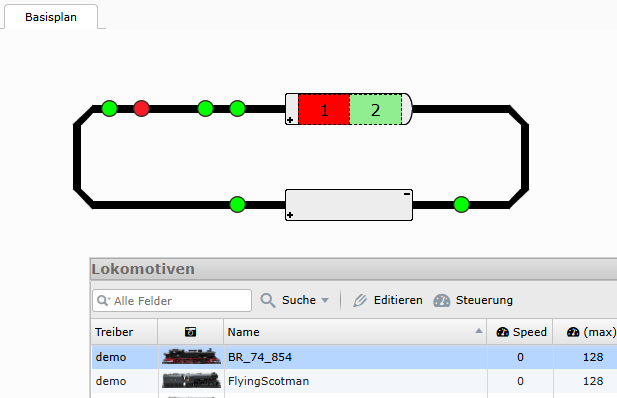

Nach der Standardwartezeit wird der nächste Subblock im Aufstellblock als Ziel gewählt und angesteuert.

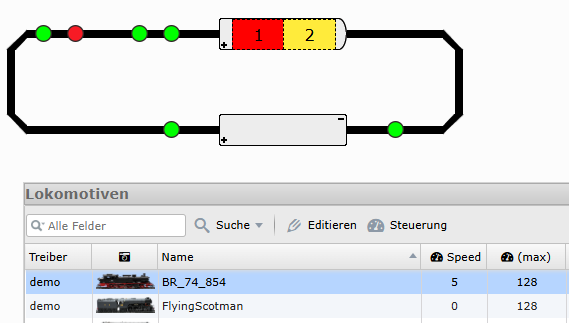

Wir können nun kontinuierlich die Lokomotive simuliert im Kreis fahren lassen.

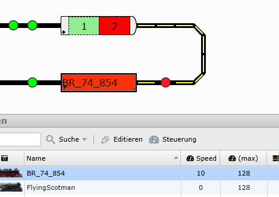
