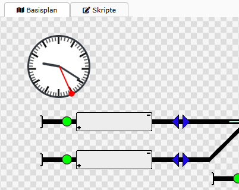
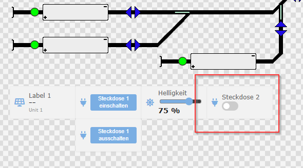
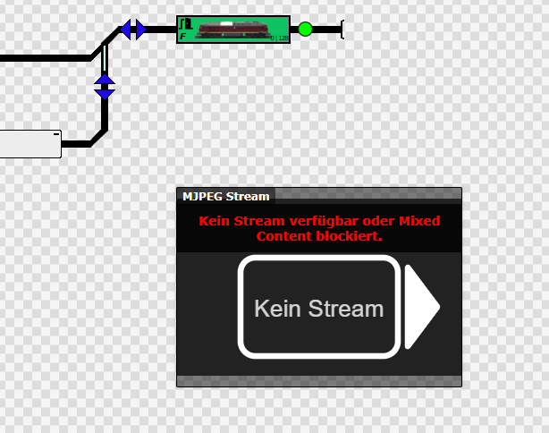
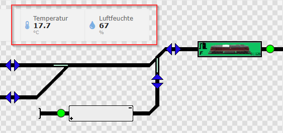

# Einleitung

## User Interface mit Skripten

Die Benutzeroberfläche von `railhq.io` kann vollständig über JavaScript-Skripte angepasst und erweitert werden. Herzstück ist dabei die sogenannte uiEngine, die über die Funktion `hqUi.register(..)` verschiedene UI-Elemente (sogenannte Controls) zum Gleisplan hinzufügt.

Dies ermöglicht eine maximale Flexibilität, z. B. zur Anzeige von Statuswerten, zur Interaktion mit Schaltern, zur Steuerung von Anlagenfunktionen oder zur Visualisierung externer Datenquellen wie Webcams oder MJPEG-Streams.

## Übersicht verfügbarer UI-Tiles

| Typ        | Beschreibung                                                                 |
| ---------- | ---------------------------------------------------------------------------- |
| `tile`     | Einfaches Datenfeld zur Anzeige eines Wertes inkl. Icon, Label, Einheit usw. |
| `button`   | Button zur Ausführung einer benutzerdefinierten Aktion oder eines Skripts    |
| `toggle`   | Schalter zur Umschaltung zwischen zwei Zuständen                             |
| `slider`   | Schieberegler zur Einstellung eines Wertes in einem vorgegebenen Bereich     |
| `snapshot` | Webcam-Snapshot mit regelmäßiger Bildaktualisierung                          |
| `mjpeg`    | MJPEG-Streamanzeige für echte Live-Bilder                                    |
| `clock`    | Bahnhofsuhr mit Synchronisation zur echten Uhrzeit                           |

### Beispiel: Bahnhofsuhr

```javascript
hqUi.injectDefaultStyles();

// Bahnhofsuhr
hqUi.register({ id: "bahnhofsuhr", type: "clock", x: 2, y: 1, draggable: true });

hqHelper.finalize = async () => {
    log("Benutzerdefinierter Cleanup läuft...");
    hqUi.finalize();
};
while (!api.shouldStop?.()) {
    await new Promise(resolve => setTimeout(resolve, 500));
} 
```



### Beispiel: Toggle-Control zur Steuerung eines Relais

```javascript
hqUi.register({
    id: "toggle1",
    type: "toggle",
    label: "Steckdose 2",
    icon: "fas fa-plug",
    value: false,
    onToggle: async (state) => {
        log("Steckdose ist jetzt", state ? "an" : "aus");

        await hqMqttClient.publishOnce(
            "wss://192.168.178.29:9001", 
            "Haus/Switches/Railway02", 
            `${state}`);
    }, x: 14, y: 10
});
```



### Beispiel: MJPEG-Stream

```javascript
hqUi.injectDefaultStyles();

hqUi.register({
    id: 'Kaiskuru Skistadion, Norway - Snow and Houses',
    type: 'mjpeg',
    x: 21, y: 10,
    ratio: 4 / 3,
    url: 'http://77.222.181.11:8080/mjpg/video.mjpg'
})

hqHelper.finalize = async () => {
    log("Benutzerdefinierter Cleanup läuft...");
    hqUi.finalize();
};

// Halte das Skript am Leben, bis "Stop" gedrückt wurde
while (!api.shouldStop?.()) {
    await new Promise(resolve => setTimeout(resolve, 500));
}
```

Man beachte die `url` mit `http` als Protokoll, hier kann das Problem des sog. *Mixed Content* zum Tragen. `railhq.io` ist ein abgesicherter Dienst mit *SSL/TLS* und heutige Browser blockieren den Zugriff auf unsicher Verbindungen, wenn diese aus sicheren Umgebungen erfolgen.

Daher wird der Stream nicht direkt geladen.



### Beispiel: Einfaches Datenfeld

```javascript
startMqttOverlay("192.168.178.29");

async function startMqttOverlay(mqttHost) {

    const brokerUrl = 'wss://' + mqttHost + ':9001';
    const topics = {
        'Haus/Data/Temperature': { label: 'Temperatur', unit: '°C', icon: 'fas fa-thermometer-half' },
        'Haus/Data/Humidity': { label: 'Luftfeuchte', unit: '%', icon: 'fas fa-tint' }
    };

    hqUi.injectDefaultStyles();

    // Komponenten registrieren
    let x = 2;
    let y = 2;
    for (const topic in topics) {
        const cfg = topics[topic];
        hqUi.register({ id: topic, label: cfg.label, unit: cfg.unit, icon: cfg.icon, x: x, y: y });
        x += 4;
    }

    // MQTT-Verbindung aufbauen
    try {
        await hqMqttClient.connect(brokerUrl);
        log('MQTT verbunden:', brokerUrl);
    } catch (err) {
        error('MQTT-Verbindung fehlgeschlagen:', err);
        return;
    }

    // MQTT-Daten empfangen
    for (const topic of Object.keys(topics)) {
        hqMqttClient.subscribe(topic, (receivedTopic, payload) => {
            const value = payload.split(" ")[0];
            hqUi.update(receivedTopic, value);
        });
    }

    // Cleanup registrieren
    hqHelper.finalize = async () => {
        log("Benutzerdefinierter Cleanup läuft...");

        hqUi.finalize(); // alle Tiles entfernen

        try {
            await hqMqttClient.disconnect();
            hqMqttClient.cleanupAll();
        } catch (e) {
            warn("Fehler beim Trennen der MQTT-Verbindung:", e);
        }

        log("Cleanup abgeschlossen!");
    };
}

// Skript am Leben halten, bis Stop gedrückt wird
while (!api.shouldStop?.()) {
    await new Promise(resolve => setTimeout(resolve, 500));
}
```



## Anmerkungen

- Die Koordinaten x und y geben die Position auf dem Gleisplanraster an (je 32×32 Pixel pro Tile).

- Breite (width) ist in Tile-Einheiten angegeben. Die Höhe wird entweder manuell gesetzt (height) oder automatisch aus dem Seitenverhältnis berechnet.

- Für MJPEG- und Snapshot-Elemente ist ein HTTPS-Link erforderlich, da sonst moderne Browser aus Sicherheitsgründen blockieren (Mixed Content Policy).

- Dank der Flexibilität lassen sich mit wenig Code interaktive Bedienpanels direkt in den Gleisplan integrieren – ganz ohne zusätzliche Fenster oder Seitenwechsel.
